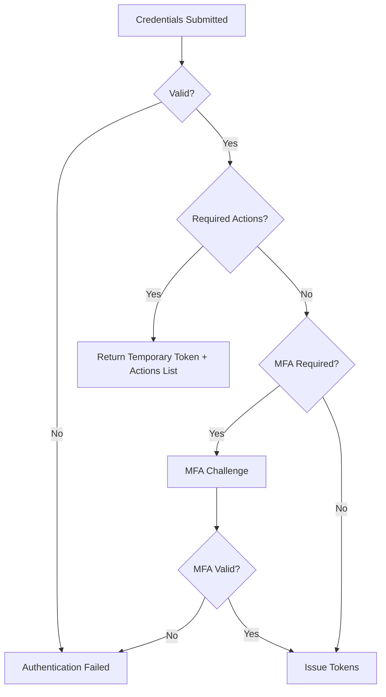

# Authentication

FerrisKey implements the OAuth 2.0 and OpenID Connect specifications. Authentication always produces tokens, the grant type determines how the user (or client) proves their identity.

## OpenID Connect Discovery

OpenID Connect applications need to know where the authorization server lives and which endpoints it exposes. FerrisKey publishes that information through the discovery endpoint:

```text
/realms/{realm}/.well-known/openid-configuration
```

For example, if FerrisKey is available at `https://sso.example.com` and your realm is `home`, the discovery endpoint is:

```text
https://sso.example.com/realms/home/.well-known/openid-configuration
```

This endpoint returns a JSON document that OIDC clients can read automatically. It includes values such as:

| Field | What it tells the application |
|---|---|
| `issuer` | The canonical URL for this realm as an identity provider |
| `authorization_endpoint` | Where the browser is sent to start login |
| `token_endpoint` | Where the application exchanges codes for tokens |
| `userinfo_endpoint` | Where the application can fetch profile information |
| `jwks_uri` | Where public signing keys are exposed so tokens can be verified |
| `scopes_supported` | Which scopes can be requested, such as `openid`, `profile`, and `email` |

Most applications use discovery so you do not have to paste every endpoint by hand. You give the application either the discovery endpoint or the issuer URL, and it learns the rest from FerrisKey.

:::callout{variant="info" title="Issuer and discovery are not always the same setting"}
If an application asks for the **issuer** or **authority**, use the realm URL, for example `https://sso.example.com/realms/home`. If it asks for the **discovery endpoint** or **OpenID configuration URL**, use the full `/.well-known/openid-configuration` URL.
:::

## Grant Types

### Authorization Code

The most secure flow for web applications. The user is redirected to FerrisKey, authenticates, and is sent back to the client with an authorization code that gets exchanged for tokens.

**Flow:**
1. Client redirects user to `/realms/{realm}/protocol/openid-connect/auth`
2. User authenticates (credentials, MFA if required)
3. FerrisKey redirects back with a `code` parameter
4. Client exchanges the code at the token endpoint (server-side)
5. FerrisKey returns access, refresh, and ID tokens

**Best for:** Web applications, SPAs with a backend.

### Password (Resource Owner)

The client collects credentials directly and sends them to the token endpoint. Simple but less secure, the client handles the user's password.

**Flow:**
1. Client sends `grant_type=password`, `username`, `password` to the token endpoint
2. FerrisKey validates credentials
3. If MFA is required, returns a temporary token with `requires_otp_challenge` status
4. Client completes MFA challenge with the temporary token
5. FerrisKey returns full tokens

**Best for:** Trusted first-party applications, testing, CLI tools.

:::callout{variant="warning" title="Direct access grants required"}
The client must have `direct_access_grants_enabled` to use this flow.
:::

### Client Credentials

Machine-to-machine authentication. The client authenticates with its own credentials (client ID + secret), no user involved.

**Flow:**
1. Client sends `grant_type=client_credentials`, `client_id`, `client_secret`
2. FerrisKey validates client credentials
3. Returns an access token (no refresh token, no ID token)

**Best for:** Backend services, cron jobs, microservice communication.

### Refresh Token

Renew an expired access token without re-authentication.

**Flow:**
1. Client sends `grant_type=refresh_token` with the refresh token
2. FerrisKey validates the refresh token
3. Returns new access and refresh tokens

**Best for:** Any flow that issued a refresh token and needs to maintain a session.

## Authentication Chain

When a user authenticates, FerrisKey follows a strict chain:



1. **Credential Validation**: Username and password are verified
2. **Required Actions Check**: If the user has pending actions (ConfigureOtp, VerifyEmail, UpdatePassword), a temporary token is returned
3. **MFA Check**: If TOTP or WebAuthn is configured, the user must complete the challenge
4. **Token Issuance**: Full access, refresh, and ID tokens are generated

## Auth Sessions

An **auth session** tracks the state of an in-progress authentication. It holds:

- The client and realm context
- The redirect URI and OAuth2 parameters (`state`, `nonce`, `scope`)
- The authorization code (after successful auth)
- WebAuthn challenge data (if applicable)
- The linked Compass flow (if the flow engine is enabled)

Auth sessions are short-lived and expire automatically.
