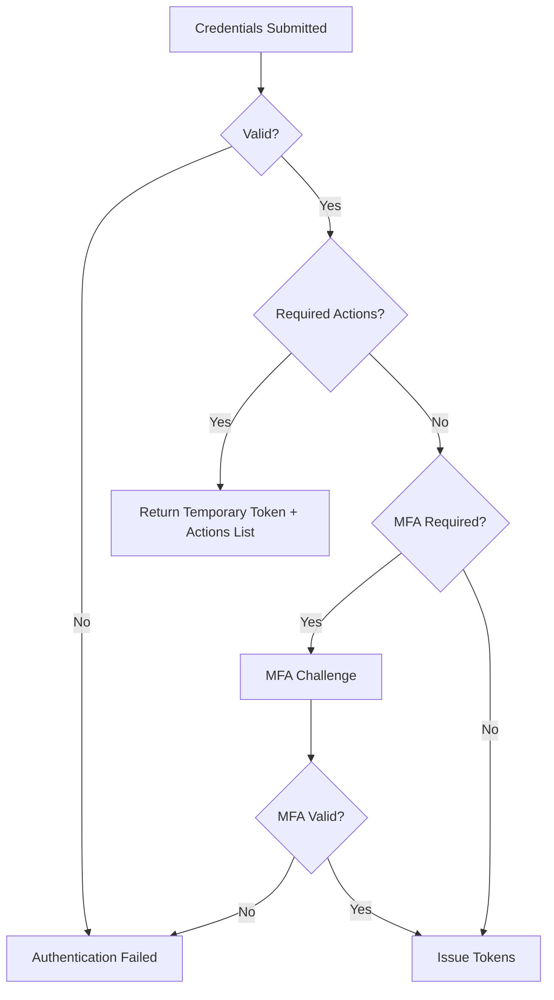

# Authentication

FerrisKey implements the OAuth 2.0 and OpenID Connect specifications. Authentication always produces tokens — the grant type determines how the user (or client) proves their identity.

## Grant Types

### Authorization Code

The most secure flow for web applications. The user is redirected to FerrisKey, authenticates, and is sent back to the client with an authorization code that gets exchanged for tokens.

**Flow:**
1. Client redirects user to `/realms/{realm}/protocol/openid-connect/auth`
2. User authenticates (credentials, MFA if required)
3. FerrisKey redirects back with a `code` parameter
4. Client exchanges the code at the token endpoint (server-side)
5. FerrisKey returns access, refresh, and ID tokens

**Best for:** Web applications, SPAs with a backend.

### Password (Resource Owner)

The client collects credentials directly and sends them to the token endpoint. Simple but less secure — the client handles the user's password.

**Flow:**
1. Client sends `grant_type=password`, `username`, `password` to the token endpoint
2. FerrisKey validates credentials
3. If MFA is required, returns a temporary token with `requires_otp_challenge` status
4. Client completes MFA challenge with the temporary token
5. FerrisKey returns full tokens

**Best for:** Trusted first-party applications, testing, CLI tools.

:::callout{variant="warning" title="Direct access grants required"}
The client must have `direct_access_grants_enabled` to use this flow.
:::

### Client Credentials

Machine-to-machine authentication. The client authenticates with its own credentials (client ID + secret) — no user involved.

**Flow:**
1. Client sends `grant_type=client_credentials`, `client_id`, `client_secret`
2. FerrisKey validates client credentials
3. Returns an access token (no refresh token, no ID token)

**Best for:** Backend services, cron jobs, microservice communication.

### Refresh Token

Renew an expired access token without re-authentication.

**Flow:**
1. Client sends `grant_type=refresh_token` with the refresh token
2. FerrisKey validates the refresh token
3. Returns new access and refresh tokens

**Best for:** Any flow that issued a refresh token and needs to maintain a session.

## Authentication Chain

When a user authenticates, FerrisKey follows a strict chain:

1. **Credential Validation** — Username and password are verified
2. **Required Actions Check** — If the user has pending actions (ConfigureOtp, VerifyEmail, UpdatePassword), a temporary token is returned
3. **MFA Check** — If TOTP or WebAuthn is configured, the user must complete the challenge
4. **Token Issuance** — Full access, refresh, and ID tokens are generated

## Auth Sessions

An **auth session** tracks the state of an in-progress authentication. It holds:

- The client and realm context
- The redirect URI and OAuth2 parameters (`state`, `nonce`, `scope`)
- The authorization code (after successful auth)
- WebAuthn challenge data (if applicable)
- The linked Compass flow (if the flow engine is enabled)

Auth sessions are short-lived and expire automatically.
