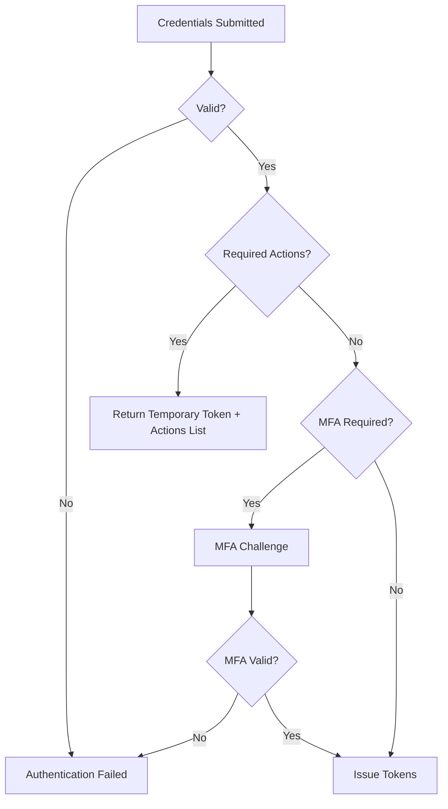

# Authentication

FerrisKey authenticates over **two protocols**:

| Protocol | Front door | What the application receives |
|---|---|---|
| **OAuth 2.0 / OpenID Connect** | `/protocol/openid-connect/*` | Access, refresh and ID tokens |
| **SAML 2.0** | `/protocol/saml` | One signed XML assertion |

They differ only at the edges. Underneath, both funnel through the same login, the same MFA, the same lockout and the same audit trail — the [authentication chain](#authentication-chain) below is shared, and it is the part worth understanding first.

Most of this page is about OIDC, because that is the default and the richer surface. [SAML](#saml-20) has its own section.

## OpenID Connect discovery

OpenID Connect applications need to know where the authorization server lives and which endpoints it exposes. FerrisKey publishes that information through the discovery endpoint:

```text
/realms/{realm}/.well-known/openid-configuration
```

For example, if FerrisKey is available at `https://sso.example.com` and your realm is `home`, the discovery endpoint is:

```text
https://sso.example.com/realms/home/.well-known/openid-configuration
```

This endpoint returns a JSON document that OIDC clients can read automatically. It includes values such as:

| Field | What it tells the application |
|---|---|
| `issuer` | The canonical URL for this realm as an identity provider |
| `authorization_endpoint` | Where the browser is sent to start login |
| `token_endpoint` | Where the application exchanges codes for tokens |
| `userinfo_endpoint` | Where the application can fetch profile information |
| `jwks_uri` | Where public signing keys are exposed so tokens can be verified |
| `grant_types_supported` | Which grant types this realm accepts |
| `code_challenge_methods_supported` | Which PKCE methods are available |

Most applications support discovery, so you rarely paste endpoints by hand. Give the application the discovery URL or the issuer, and it reads the rest from FerrisKey.

:::callout{variant="warning" title="The document under-reports the grants"}
`grant_types_supported` currently advertises `authorization_code`, `refresh_token`, `client_credentials` and `password` only. The [device code grant](#device-code) is served but not listed, and the document carries no `device_authorization_endpoint`, so a client that configures itself purely from discovery will not find the device flow. Configure that one by hand.
:::

:::callout{variant="info" title="Issuer and discovery are not the same setting"}
When an application asks for the issuer or the authority, give it the realm URL, for example `https://sso.example.com/realms/home`. When it asks for the discovery endpoint or the OpenID configuration URL, give it the full `/.well-known/openid-configuration` address.
:::

## Grant types

A grant type is an OAuth2 notion: it names *how* the client proves who it is acting for. SAML has no equivalent — see [bindings](#saml-20) instead.

### Authorization code

The safest flow for web applications. The user is redirected to FerrisKey, authenticates there, and comes back to the client with a code that the client exchanges for tokens.

The steps:
1. Client redirects user to `/realms/{realm}/protocol/openid-connect/auth`
2. User authenticates (credentials, MFA if required)
3. FerrisKey redirects back with a `code` parameter
4. Client exchanges the code at the token endpoint (server-side)
5. FerrisKey returns access, refresh, and ID tokens

Best for web applications and single-page apps with a backend.

### Password (resource owner) — deprecated

:::callout{variant="danger" title="Deprecated"}
The password grant is deprecated. It is still served, so existing integrations keep working, but do not build anything new on it — OAuth 2.1 removes it, and it is incompatible with anything the client cannot see, which includes passkeys and any federated login.

For a CLI or another device without a browser, use the [device code grant](#device-code) instead. For a first-party web application, use [authorization code](#authorization-code) with PKCE.
:::

The client collects the credentials itself and posts them to the token endpoint. Simpler, and weaker: the client sees the user's password.

The steps:
1. Client sends `grant_type=password`, `username`, `password` to the token endpoint
2. FerrisKey validates credentials
3. If MFA is required, returns a temporary token with `requires_otp_challenge` status
4. Client completes MFA challenge with the temporary token
5. FerrisKey returns full tokens

Only appropriate for an existing integration that has not migrated yet.

:::callout{variant="warning" title="Direct access grants required"}
The client needs `direct_access_grants_enabled` for this flow to work.
:::

### Client credentials

Machine to machine. The client authenticates with its own client id and secret, and no user is involved.

The steps:
1. Client sends `grant_type=client_credentials`, `client_id`, `client_secret`
2. FerrisKey validates client credentials
3. Returns an access token (no refresh token, no ID token)

Best for backend services, cron jobs, and calls between microservices.

### Refresh token

Renew an expired access token without sending the user back through login.

The steps:
1. Client sends `grant_type=refresh_token` with the refresh token
2. FerrisKey validates the refresh token
3. Returns new access and refresh tokens

Best for any flow that issued a refresh token and needs to keep a session alive.

### Device code

```
urn:ietf:params:oauth:grant-type:device_code
```

The flow for anything that cannot host a browser, or cannot be trusted with a password: a CLI, a TV app, a headless box. The device never sees the credential. It asks FerrisKey for a code, tells the user where to type it, and polls until the user has approved it in their own browser — where MFA, passkeys and federated login all work normally.

This is how `ferris-ctl login` connects.

The steps:

1. The device posts to `/realms/{realm}/protocol/openid-connect/auth/device`. A public client passes `client_id` in the form body; a confidential client authenticates with HTTP Basic.
2. FerrisKey returns a device code, a short end-user code, and the verification URI to display.
3. The device shows the user code and the URI, and starts polling the token endpoint with `grant_type=urn:ietf:params:oauth:grant-type:device_code` and the device code.
4. The user opens `/realms/{realm}/device` in any browser, enters the code, and authenticates — full chain, MFA included.
5. The next poll returns tokens.

While the user has not finished, the poll answers with the RFC 8628 error codes — `authorization_pending`, `slow_down`, `access_denied`, `expired_token` — so a client can tell "not yet" from "refused" and back off accordingly.

| Endpoint | Purpose |
|---|---|
| `POST /realms/{realm_name}/protocol/openid-connect/auth/device` | Start the flow, get the codes |
| `GET /realms/{realm_name}/device` | Page where the user enters the code |
| `POST /realms/{realm_name}/device/verify` | Submit the code |
| `POST /realms/{realm_name}/protocol/openid-connect/token` | Poll for the tokens |

:::callout{variant="warning" title="The client has to allow it"}
The client needs `oauth_device_code_grant_enabled`. Without it the first call is refused.
:::

The flow is also observable: [webhooks](/en/modules/webhooks/triggers) fire `auth.device_flow.initiated`, `auth.device_flow.denied` and `auth.device_flow.expired`.

### Token exchange — not served yet

```
urn:ietf:params:oauth:grant-type:token-exchange
```

RFC 8693 token exchange is **modelled but not implemented**. The grant type parses, the request and response shapes exist, and a `token_exchange_policies` table is in the schema carrying a target audience, allowed scopes, and impersonation and delegation switches per client. None of it is wired: the token endpoint answers `invalid_request` for this grant.

Do not build on it, and do not read the presence of the policy table as a feature. When it does ship, the shape it will take is the RFC's: a `subject_token` plus its `subject_token_type`, an optional `requested_token_type`, `audience`, `resource` and `scope`, with the issued scope constrained to a subset of the subject token's.

If what you need today is one service calling another under its own identity, use [client credentials](#client-credentials). If you need to carry the end user's identity across a service boundary, pass the access token itself and validate it at each hop.

## The OIDC endpoints

These are the integration surface: what an application, a resource server or a gateway talks to. All are relative to `/realms/{realm_name}/protocol/openid-connect`.

| Method | Path | Purpose |
|---|---|---|
| `GET` | `/auth` | Start the authorization code flow |
| `POST` | `/auth/device` | Start the device flow (RFC 8628 §3.1) |
| `POST` | `/token` | Exchange a code, refresh token or device code for tokens |
| `POST` | `/token/introspect` | Token introspection (RFC 7662) |
| `GET` | `/userinfo` | Profile claims for the bearer of an access token |
| `POST` | `/revoke` | Revoke an access or refresh token (RFC 7009) |
| `GET` `POST` | `/logout` | RP-initiated logout |
| `GET` | `/certs` | The realm's JWK keys |
| `GET` | `/jwks.json` | The realm's JWKS, for validating signatures |
| `POST` | `/registrations` | Self-service registration, when the realm allows it |

:::callout{variant="info" title="Introspection is for confidential clients only"}
`/token/introspect` may only be called by a confidential client, authenticating with `client_secret_basic` or `client_secret_post`, and the caller's service account needs the right permission. A public client cannot introspect — validate the JWT signature against `/jwks.json` instead, which needs no credential and no round trip.
:::

Logout accepts `id_token_hint`, `post_logout_redirect_uri`, `state` and `client_id`. The redirect target has to be registered on the client as a [post-logout redirect](/en/discover/core-concepts/clients#sub-resources), otherwise it is refused.

`/certs` and `/jwks.json` both expose key material and neither requires authentication — they are meant to be public. There is also an unannotated `/jwks` alias that answers the same thing; prefer `/jwks.json`, which is the one the discovery document advertises.

:::callout{variant="info" title="Building your own login pages?"}
The endpoints the portal itself drives — the login form, the MFA challenge, the reset flow — are a separate family. See [Login Actions](/en/modules/portal/login-actions).
:::

## SAML 2.0

For applications that speak nothing else, FerrisKey acts as a **SAML identity provider**: a service provider sends an `AuthnRequest`, the user signs in through the normal FerrisKey login, and FerrisKey posts back a signed assertion.

### Bindings instead of grants

SAML has no grant types. What it has is **bindings** — how the request travels — and FerrisKey serves both on one path:

| Method | Path | Binding |
|---|---|---|
| `GET` | `/realms/{realm_name}/protocol/saml` | HTTP-Redirect |
| `POST` | `/realms/{realm_name}/protocol/saml` | HTTP-POST |
| `GET` | `/realms/{realm_name}/protocol/saml/continue` | Resume after the user has authenticated |
| `GET` | `/realms/{realm_name}/protocol/saml/descriptor` | IdP metadata to hand to a service provider |

The descriptor is the equivalent of the discovery document: point a service provider at that URL and it learns the entity id, the SSO endpoints and the signing certificate on its own.

### A client speaks one protocol

A client carries a `protocol` — `openid-connect` (the default) or `saml` — and **it is set at creation and cannot be changed afterwards**, like the confidential/public choice. An application that migrates from SAML to OIDC gets a new client, not an edited one.

A SAML client has two collections of its own:

```
GET PUT        /realms/{realm_name}/clients/{client_id}/saml-config
GET POST       /realms/{realm_name}/clients/{client_id}/saml-attribute-mappers
DELETE         /realms/{realm_name}/clients/{client_id}/saml-attribute-mappers/{mapper_id}
```

Attribute mappers are SAML's answer to [protocol mappers](/en/modules/aegis/protocol-mappers): they decide which user data lands in the assertion. The two systems are separate — a protocol mapper does not affect an assertion, and an attribute mapper does not affect a JWT.

### What SAML does not get

The OIDC surface has no SAML counterpart, and that is a protocol difference rather than a gap:

- **No refresh tokens.** The assertion is the whole answer; there is nothing to refresh.
- **No `userinfo`, no introspection.** Everything the service provider learns is inside the assertion it already holds.
- **No device flow, no client credentials.** Both are OAuth2 constructs.

### One configuration trap

The IdP entity id is derived from the public base URL and signed into **every** assertion, so it cannot move. With `SERVER_PUBLIC_URL` unset, FerrisKey falls back to the request's `Host` header — harmless for OIDC, and fatal for SAML the moment a request arrives through a different hostname: the entity id changes and service providers reject the assertion.

:::callout{variant="warning" title="Set SERVER_PUBLIC_URL before enabling SAML"}
This is the single most common SAML misconfiguration, and it fails intermittently rather than outright — which makes it expensive to diagnose. Set it to the origin browsers and service providers actually reach. See [Configuration](/en/discover/guides/configuration).
:::

[SAML 2.0](/en/discover/core-concepts/saml) has the rest: registering a service provider, Name ID formats, the attribute mapper reference, the full flow diagram, and assertion validity.

## Authentication chain

Both protocols run through the same chain. Whether the request arrived as an OIDC authorization request or a SAML `AuthnRequest`, what happens between the user and the credential is identical:


```mermaid
graph TD
    C[Credentials Submitted] --> V{Valid?}
    V -->|No| F[Authentication Failed]
    V -->|Yes| RA{Required Actions?}
    RA -->|Yes| TT[Return Temporary Token + Actions List]
    RA -->|No| MFA{MFA Required?}
    MFA -->|Yes| MC[MFA Challenge]
    MC --> MV{MFA Valid?}
    MV -->|No| F
    MV -->|Yes| T[Issue Tokens]
    MFA -->|No| T
```

1. Credential validation. The username and password are verified.
2. Required actions. If any are pending (`configure_otp`, `verify_email`, `update_password`, `configure_passkey`), a temporary token comes back instead of the real thing.
3. MFA. If TOTP or WebAuthn is configured, the challenge has to be answered.
4. Token issuance. Access, refresh and ID tokens are generated — or, for a SAML request, the assertion is built and signed.

Everything downstream is shared too. [Compass](/en/modules/compass/overview) records SAML executions alongside OIDC ones, with `saml_authn_request` and `saml_assertion` as their own steps, and [SeaWatch](/en/modules/seawatch/overview) logs the same `login_success` and `login_failure` events whichever protocol asked. There is no separate SAML audit trail to go looking for.

## Auth sessions

An auth session tracks a login in progress. It holds:

- The client and realm context
- The redirect URI and OAuth2 parameters (`state`, `nonce`, `scope`)
- The authorization code (after successful auth)
- WebAuthn challenge data (if applicable)
- The linked Compass flow (if the flow engine is enabled)

Auth sessions are short-lived and expire on their own.
