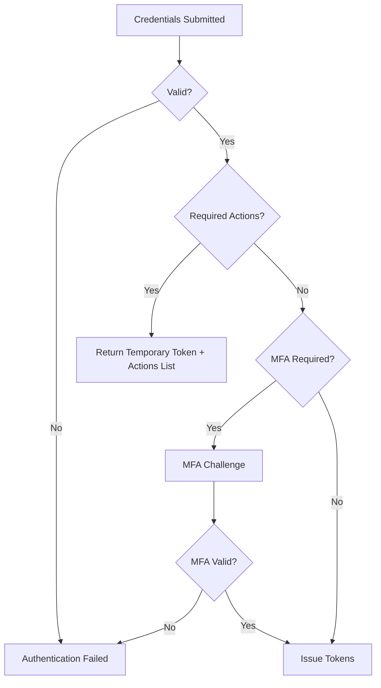

# Authentication

FerrisKey implements OAuth 2.0 and OpenID Connect. Authentication always ends in tokens; the grant type decides how the user, or the client, proves who they are.

## OpenID Connect discovery

OpenID Connect applications need to know where the authorization server lives and which endpoints it exposes. FerrisKey publishes that information through the discovery endpoint:

```text
/realms/{realm}/.well-known/openid-configuration
```

For example, if FerrisKey is available at `https://sso.example.com` and your realm is `home`, the discovery endpoint is:

```text
https://sso.example.com/realms/home/.well-known/openid-configuration
```

This endpoint returns a JSON document that OIDC clients can read automatically. It includes values such as:

| Field | What it tells the application |
|---|---|
| `issuer` | The canonical URL for this realm as an identity provider |
| `authorization_endpoint` | Where the browser is sent to start login |
| `token_endpoint` | Where the application exchanges codes for tokens |
| `userinfo_endpoint` | Where the application can fetch profile information |
| `jwks_uri` | Where public signing keys are exposed so tokens can be verified |
| `scopes_supported` | Which scopes can be requested, such as `openid`, `profile`, and `email` |

Most applications support discovery, so you rarely paste endpoints by hand. Give the application the discovery URL or the issuer, and it reads the rest from FerrisKey.

:::callout{variant="info" title="Issuer and discovery are not the same setting"}
When an application asks for the issuer or the authority, give it the realm URL, for example `https://sso.example.com/realms/home`. When it asks for the discovery endpoint or the OpenID configuration URL, give it the full `/.well-known/openid-configuration` address.
:::

## Grant types

### Authorization code

The safest flow for web applications. The user is redirected to FerrisKey, authenticates there, and comes back to the client with a code that the client exchanges for tokens.

The steps:
1. Client redirects user to `/realms/{realm}/protocol/openid-connect/auth`
2. User authenticates (credentials, MFA if required)
3. FerrisKey redirects back with a `code` parameter
4. Client exchanges the code at the token endpoint (server-side)
5. FerrisKey returns access, refresh, and ID tokens

Best for web applications and single-page apps with a backend.

### Password (resource owner)

The client collects the credentials itself and posts them to the token endpoint. Simpler, and weaker: the client sees the user's password.

The steps:
1. Client sends `grant_type=password`, `username`, `password` to the token endpoint
2. FerrisKey validates credentials
3. If MFA is required, returns a temporary token with `requires_otp_challenge` status
4. Client completes MFA challenge with the temporary token
5. FerrisKey returns full tokens

Best for trusted first-party applications, testing, and CLI tools.

:::callout{variant="warning" title="Direct access grants required"}
The client needs `direct_access_grants_enabled` for this flow to work.
:::

### Client credentials

Machine to machine. The client authenticates with its own client id and secret, and no user is involved.

The steps:
1. Client sends `grant_type=client_credentials`, `client_id`, `client_secret`
2. FerrisKey validates client credentials
3. Returns an access token (no refresh token, no ID token)

Best for backend services, cron jobs, and calls between microservices.

### Refresh token

Renew an expired access token without sending the user back through login.

The steps:
1. Client sends `grant_type=refresh_token` with the refresh token
2. FerrisKey validates the refresh token
3. Returns new access and refresh tokens

Best for any flow that issued a refresh token and needs to keep a session alive.

## Authentication chain

Every user authentication runs through the same chain:


```mermaid
graph TD
    C[Credentials Submitted] --> V{Valid?}
    V -->|No| F[Authentication Failed]
    V -->|Yes| RA{Required Actions?}
    RA -->|Yes| TT[Return Temporary Token + Actions List]
    RA -->|No| MFA{MFA Required?}
    MFA -->|Yes| MC[MFA Challenge]
    MC --> MV{MFA Valid?}
    MV -->|No| F
    MV -->|Yes| T[Issue Tokens]
    MFA -->|No| T
```

1. Credential validation. The username and password are verified.
2. Required actions. If any are pending (`configure_otp`, `verify_email`, `update_password`, `configure_passkey`), a temporary token comes back instead of the real thing.
3. MFA. If TOTP or WebAuthn is configured, the challenge has to be answered.
4. Token issuance. Access, refresh, and ID tokens are generated.

## Auth sessions

An auth session tracks a login in progress. It holds:

- The client and realm context
- The redirect URI and OAuth2 parameters (`state`, `nonce`, `scope`)
- The authorization code (after successful auth)
- WebAuthn challenge data (if applicable)
- The linked Compass flow (if the flow engine is enabled)

Auth sessions are short-lived and expire on their own.
