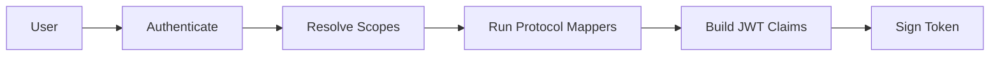

# Client Scopes

Client scopes control what information appears in tokens. A scope groups a set of **protocol mappers** — rules that extract user or client data and inject it as JWT claims.

## Scope Types

| Type | Behavior |
|---|---|
| **Default** | Automatically included in every token issued for a client |
| **Optional** | Only included when explicitly requested in the `scope` parameter |
| **None** | Not assigned to any client by default |

## Standard OIDC Scopes

FerrisKey includes the standard OpenID Connect scopes:

| Scope | Claims |
|---|---|
| `openid` | `sub` (subject identifier) |
| `profile` | `name`, `family_name`, `given_name`, `preferred_username` |
| `email` | `email`, `email_verified` |
| `address` | `address` |
| `phone` | `phone_number`, `phone_number_verified` |
| `offline_access` | Enables refresh token issuance |
| `introspect` | Allows token introspection |

## Protocol Mappers

Protocol mappers define how data flows into tokens. Each mapper has a type that determines its behavior:

| Mapper Type | Description |
|---|---|
| `user_attribute` | Maps a custom user attribute to a token claim |
| `user_property` | Maps a built-in user property (username, email, etc.) to a claim |
| `user_realm_role_mapper` | Includes the user's realm roles in the token |
| `user_client_role_mapper` | Includes the user's client-specific roles in the token |
| `audience_mapper` | Adds an audience (`aud`) value to the token |
| `hardcoded_claim_mapper` | Adds a static value as a claim |

Each mapper is configured with a JSON object specifying the source property, target claim name, and claim type.

## Client Scope Mapping

Scopes are linked to clients through **client scope mappings**. Each mapping specifies:

- Which client the scope applies to
- The scope type for that client (Default, Optional, or None)

This means the same scope can be a default for one client and optional for another.

## How Scopes Shape Tokens

The token generation chain:

1. User authenticates to a client
2. FerrisKey resolves which scopes apply (default + requested optional scopes)
3. Protocol mappers from each active scope execute in order
4. Mapper outputs become JWT claims
5. The token is signed with the realm's signing key

:::callout{variant="info" title="Scope = claim contract"}
Think of a scope as a contract between the client and the authorization server: "If you grant me the `profile` scope, I expect to receive the user's name and username in the token."
:::
