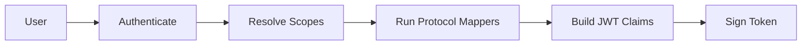

# Client Scopes

A client scope decides what ends up inside a token. It groups protocol mappers, which are the rules that pull data off a user or a client and write it into the JWT as claims.

## Scope types

| Type | Behavior |
|---|---|
| Default | Included in every token issued for the client |
| Optional | Included only when the client asks for it in the `scope` parameter |
| None | Not assigned to the client at all |

The same scope can be default for one client and optional for another. That is decided by the client scope mapping, not by the scope itself.

## Scopes seeded by default

Every realm is seeded with a standard set of OIDC scopes, and every client in the realm gets them assigned.

| Scope | Assigned as | Claims it produces |
|---|---|---|
| `openid` | default | none of its own; marks the request as OIDC |
| `profile` | default | `given_name`, `family_name`, `preferred_username` |
| `email` | default | `email`, `email_verified` |
| `roles` | default | `realm_access.roles` |
| `offline_access` | optional | none of its own |
| `phone` | optional | `phone_number` |
| `address` | optional | `address` |

## Protocol mappers

A mapper is identified by a `mapper_type` string. FerrisKey keeps the Keycloak names, so configuration written for Keycloak is recognizable here.

| `mapper_type` | What it does |
|---|---|
| `oidc-usermodel-property-mapper` | Maps a built-in user property (username, email, first name) to a claim |
| `oidc-usermodel-attribute-mapper` | Maps a custom user attribute to a claim |
| `oidc-usermodel-realm-role-mapper` | Writes the user's realm roles into the token |
| `oidc-usermodel-client-role-mapper` | Writes the user's client roles into the token |
| `oidc-group-membership-mapper` | Writes the user's group memberships |
| `oidc-organization-membership-mapper` | Writes the user's organization memberships |
| `oidc-organization-detail-mapper` | Writes details of the active organization |
| `oidc-organization-role-mapper` | Writes the user's roles within an organization |
| `oidc-audience-mapper` | Adds a value to the `aud` claim |
| `oidc-hardcoded-claim-mapper` | Adds a fixed value as a claim |

Each mapper carries a JSON `config`. The keys follow the Keycloak convention:

```json title="Mapping the username into preferred_username"
{
  "user.attribute": "username",
  "claim.name": "preferred_username",
  "access.token.claim": "true",
  "id.token.claim": "true"
}
```

`claim.name` supports dotted paths, so `realm_access.roles` produces a nested object rather than a flat key with a dot in its name.

## How scopes shape a token


```mermaid
graph LR
    U[User] --> A[Authenticate]
    A --> S[Resolve Scopes]
    S --> M[Run Protocol Mappers]
    M --> J[Build JWT Claims]
    J --> T[Sign Token]
```

1. The user authenticates against a client.
2. FerrisKey resolves which scopes apply: the client's default scopes, plus any optional ones the request asked for.
3. The mappers on each active scope run.
4. Their output becomes JWT claims, alongside the standard ones.
5. The token is signed with the realm's key.

:::callout{variant="info" title="A scope is a claim contract"}
Read a scope as an agreement between the client and the authorization server: grant me `profile`, and I expect the user's name and username to come back in the token.
:::
