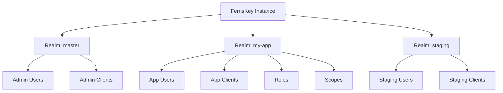

# Realms

A realm is the top-level isolation boundary in FerrisKey. Users, clients, roles, credentials, scopes, and sessions each belong to exactly one realm. Realms make multi-tenancy possible: one FerrisKey deployment can serve many independent organizations.

## What a Realm Isolates

Each realm is a self-contained identity domain:

- **Users**: accounts, profiles, and credentials
- **Clients**: applications registered for authentication
- **Roles**: permission bundles and role mappings
- **Credentials**: passwords, TOTP secrets, WebAuthn passkeys
- **Client Scopes**: token claim definitions and protocol mappers
- **Sessions**: active user sessions
- **Configuration**: token lifetimes, registration policies, feature toggles

There is no data leakage between realms. A user in realm A cannot authenticate to a client in realm B.

## The Master Realm

Every FerrisKey deployment includes a **master** realm. This is a protected realm that:

- Is created automatically on first boot
- Contains the initial admin user
- Cannot be deleted
- Manages cross-realm administration

:::callout{variant="warning" title="Do not use master for applications"}
The master realm is for administration only. Create dedicated realms for your applications.
:::

## Realm Settings

Each realm has configurable settings that control authentication behavior:

| Setting | Default | Description |
|---|---|---|
| `default_signing_algorithm` | `RS256` | JWT signing algorithm |
| `user_registration_enabled` | `false` | Allow self-service user registration |
| `forgot_password_enabled` | `false` | Enable password reset flow |
| `remember_me_enabled` | `false` | Support remember-me sessions |
| `magic_link_enabled` | `false` | Enable email-based magic link login |
| `magic_link_ttl` | `15` min | Magic link expiration time |
| `compass_enabled` | `true` | Enable the Compass authentication flow engine |
| `access_token_lifetime` | `300`s (5 min) | Default access token TTL |
| `refresh_token_lifetime` | `86400`s (24 hr) | Default refresh token TTL |
| `id_token_lifetime` | `300`s (5 min) | Default ID token TTL |
| `temporary_token_lifetime` | `300`s (5 min) | Temporary token TTL (for required actions) |

## SMTP Configuration

Each realm can configure its own SMTP settings for email delivery (magic links, password resets, email verification). This allows different realms to use different mail providers or sender addresses.
