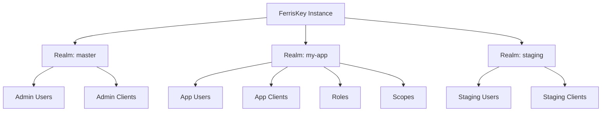

# Realms

A realm is the top-level isolation boundary in FerrisKey. Users, clients, roles, credentials, scopes, and sessions each belong to exactly one realm. Realms make multi-tenancy possible: one FerrisKey deployment can serve many independent organizations.

## What a realm isolates

Each realm is a self-contained identity domain:

- **Users**: accounts, profiles, and credentials
- **Clients**: applications registered for authentication
- **Roles**: permission bundles and role mappings
- **Credentials**: passwords, TOTP secrets, WebAuthn passkeys
- **Client Scopes**: token claim definitions and protocol mappers
- **Sessions**: active user sessions
- **Configuration**: token lifetimes, registration policies, feature toggles

Nothing leaks between realms. A user in realm A cannot authenticate against a client in realm B.

```mermaid
graph TD
    FK[FerrisKey Instance]
    FK --> R1[Realm: master]
    FK --> R2[Realm: my-app]
    FK --> R3[Realm: staging]

    R1 --> U1[Admin Users]
    R1 --> C1[Admin Clients]

    R2 --> U2[App Users]
    R2 --> C2[App Clients]
    R2 --> RO2[Roles]
    R2 --> SC2[Scopes]

    R3 --> U3[Staging Users]
    R3 --> C3[Staging Clients]
```

## The master realm

Every deployment has a `master` realm. It is created on first boot, holds the initial admin user, cannot be deleted, and is where cross-realm administration happens.

:::callout{variant="warning" title="Do not use master for applications"}
Keep `master` for administration. Give each application its own realm.
:::

## Realm settings

Every realm carries its own settings. They control how sign-in behaves, how long tokens live, and which optional features are on.

### Sign-in and registration

| Setting | Default | Description |
|---|---|---|
| `user_registration_enabled` | `false` | Allow self-service registration |
| `forgot_password_enabled` | `false` | Enable the password reset flow |
| `remember_me_enabled` | `false` | Support remember-me sessions |
| `magic_link_enabled` | `false` | Enable magic link sign-in by email |
| `magic_link_ttl_minutes` | `15` | How long a magic link stays valid |
| `passkey_enabled` | `false` | Allow passkey (WebAuthn) sign-in |
| `require_mfa` | `false` | Force every user in the realm to enroll in MFA |
| `login_aliases` | `[email, username]` | Ordered list of identifiers accepted at login. Must be non-empty and free of duplicates |
| `edit_username_enabled` | `false` | Let users change their own username |
| `email_verification_enabled` | `false` | Require users to verify their email |
| `email_verification_ttl_hours` | `24` | How long a verification link stays valid |
| `compass_enabled` | `true` | Record authentication flows with Compass |

### Token lifetimes

| Setting | Default | Description |
|---|---|---|
| `default_signing_algorithm` | `RS256` | JWT signing algorithm |
| `access_token_lifetime_secs` | `300` | Access token TTL |
| `refresh_token_lifetime_secs` | `86400` | Refresh token TTL |
| `id_token_lifetime_secs` | `300` | ID token TTL |
| `temporary_token_lifetime_secs` | `300` | Temporary token TTL, used while required actions are pending |

### Lockout

After too many failed attempts, an account is locked for a fixed window.

| Setting | Default | Description |
|---|---|---|
| `lockout_threshold` | `10` | Failed attempts before the account locks |
| `lockout_duration_seconds` | `900` | How long the lock lasts |

### Audit privacy

SeaWatch can strip or pseudonymise personal data before an event is stored.

| Setting | Default | Description |
|---|---|---|
| `seawatch_pii_mode` | `off` | One of `off`, `mask`, `pseudonymise` |
| `seawatch_pseudo_key` | unset | HMAC key used when the mode is `pseudonymise` |

### Branding and email templates

| Setting | Default | Description |
|---|---|---|
| `portal_theme_id` | unset | Theme applied to the login portal |
| `reset_password_template_id` | unset | Template used for password reset emails |
| `magic_link_template_id` | unset | Template used for magic link emails |
| `email_verification_template_id` | unset | Template used for verification emails |

Leave a template id unset and FerrisKey falls back to the built-in default for that email type.

## SMTP configuration

SMTP lives on the realm too, so two realms in the same deployment can send from different providers and different addresses. The [Email & Templates guide](/en/discover/guides/email) covers the fields and the API.
