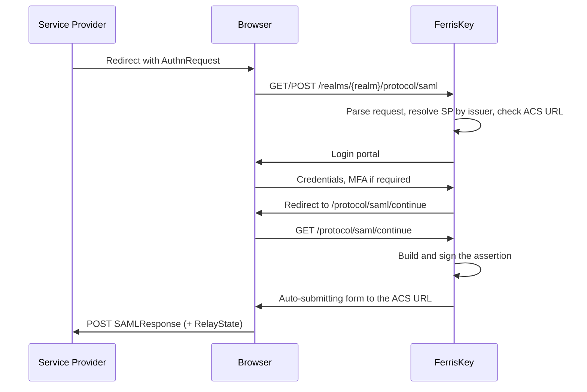

# SAML 2.0

FerrisKey speaks SAML 2.0 as an identity provider. A service provider sends it an `AuthnRequest`, the user signs in through the normal FerrisKey login, and FerrisKey posts back a signed assertion.

This is what gets an application that only supports SAML, and there are plenty of them, onto the same realm, the same users, and the same audit trail as everything else.

:::callout{variant="info" title="Identity provider, not broker"}
This page is about FerrisKey being the IdP that other applications trust. Signing in *through* an external SAML provider is the opposite direction, handled by federation in [Abyss](/en/modules/abyss/overview), and it is not shipped yet.
:::

The sign-in itself is not SAML-specific: a SAML request runs the same [authentication chain](/en/discover/core-concepts/authentication#authentication-chain) as an OIDC one — same login, same MFA, same lockout, same audit events — and only the front door and the response format differ. That page also sets the two protocols side by side if you are deciding which one an application should use.

## Endpoints

Every endpoint is realm-scoped, under the realm's protocol path.

| Method | Endpoint | Description |
|---|---|---|
| `GET` | `/realms/{realm_name}/protocol/saml` | SSO through the HTTP-Redirect binding |
| `POST` | `/realms/{realm_name}/protocol/saml` | SSO through the HTTP-POST binding |
| `GET` | `/realms/{realm_name}/protocol/saml/continue` | Resume the flow after the user has authenticated |
| `GET` | `/realms/{realm_name}/protocol/saml/descriptor` | IdP metadata, for handing to a service provider |

The descriptor is what most service providers want: point them at that URL, or download it and upload the XML, and they learn the entity id, the SSO endpoints, and the signing certificate on their own.

## The entity id and SERVER_PUBLIC_URL

The IdP entity id is derived from the public base URL and the realm name:

```
https://sso.example.com/realms/home
```

It is signed into every assertion, which means it cannot move. If it is derived from the request's `Host` header and a request arrives through a different hostname, the entity id changes and service providers reject the assertion.

:::callout{variant="warning" title="Set SERVER_PUBLIC_URL before using SAML"}
Leave `SERVER_PUBLIC_URL` unset and FerrisKey falls back to the `Host` header, which is fine for OIDC and wrong for SAML. Set it to the origin browsers and service providers actually reach, as `scheme://host[:port]`. See [Configuration](/en/discover/guides/configuration).
:::

## Registering a service provider

A SAML service provider is a FerrisKey client carrying a SAML configuration.

| Method | Endpoint | Description |
|---|---|---|
| `GET` | `/realms/{realm_name}/clients/{client_id}/saml-config` | Read the client's SAML configuration |
| `PUT` | `/realms/{realm_name}/clients/{client_id}/saml-config` | Create or replace it |

| Field | Default | Description |
|---|---|---|
| `sp_entity_id` | required | The service provider's entity id. FerrisKey resolves incoming requests by their issuer, so this must match exactly |
| `acs_url` | required | Assertion Consumer Service URL, where the signed response is posted |
| `name_id_format` | `emailAddress` | Format of the subject identifier |
| `sign_assertions` | | Sign the assertion element |
| `sign_documents` | | Sign the response document |
| `want_authn_requests_signed` | | Expect the service provider to sign its `AuthnRequest` |

If an `AuthnRequest` names an ACS URL that does not match the registered one, the request is rejected rather than redirected. That is deliberate: an unchecked ACS URL in a request is an open redirect with an assertion attached.

### Name ID formats

| Value | URN |
|---|---|
| `emailAddress` | `urn:oasis:names:tc:SAML:1.1:nameid-format:emailAddress` |
| `persistent` | `urn:oasis:names:tc:SAML:2.0:nameid-format:persistent` |
| `transient` | `urn:oasis:names:tc:SAML:2.0:nameid-format:transient` |
| `unspecified` | `urn:oasis:names:tc:SAML:1.1:nameid-format:unspecified` |

The short name and the full URN are both accepted when writing the config. A format the user cannot satisfy fails the flow: asking for `emailAddress` on a user with no email address produces an error rather than an empty subject.

## Attribute mappers

Beyond the subject, a service provider usually wants attributes. Mappers say which user field goes out under which SAML attribute name.

| Method | Endpoint | Description |
|---|---|---|
| `GET` | `/realms/{realm_name}/clients/{client_id}/saml-attribute-mappers` | List the client's mappers |
| `POST` | `/realms/{realm_name}/clients/{client_id}/saml-attribute-mappers` | Create a mapper |
| `DELETE` | `/realms/{realm_name}/clients/{client_id}/saml-attribute-mappers/{mapper_id}` | Delete a mapper |

A mapper has a `name`, a `name_format`, and a `source`.

Sources are written as prefixed strings:

| Source | Value |
|---|---|
| User id | `user:id` |
| Username | `user:username` |
| Email | `user:email` |
| First name | `user:first_name` |
| Last name | `user:last_name` |
| A custom user attribute | `attribute:<key>` |

Name formats:

| Value | URN |
|---|---|
| `basic` | `urn:oasis:names:tc:SAML:2.0:attrname-format:basic` |
| `uri` | `urn:oasis:names:tc:SAML:2.0:attrname-format:uri` |
| `unspecified` | `urn:oasis:names:tc:SAML:2.0:attrname-format:unspecified` |

```json title="POST .../saml-attribute-mappers"
{
  "name": "email",
  "name_format": "urn:oasis:names:tc:SAML:2.0:attrname-format:basic",
  "source": "user:email"
}
```

## The flow



The `RelayState` the service provider sent is carried through and returned untouched, which is how it recovers the page the user was heading to.

## Assertion validity

| Constant | Value |
|---|---|
| Assertion lifetime | 300 seconds |
| Allowed clock skew | 60 seconds |

The skew window exists because the service provider's clock is not yours. If assertions are being rejected as not-yet-valid or expired, check NTP on both sides before anything else.
