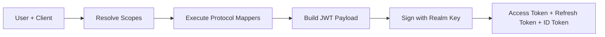

# Tokens

FerrisKey issues JSON Web Tokens (JWTs) as the result of successful authentication. Each token type serves a specific purpose in the OAuth2/OIDC protocol.

## Token Types

| Token | Purpose | Typical Lifetime |
|---|---|---|
| **Access Token** | Authorize API requests to resource servers | 300s (5 min) |
| **Refresh Token** | Obtain new access tokens without re-authentication | 86400s (24 hr) |
| **ID Token** | Convey user identity to the client (OIDC) | 300s (5 min) |
| **Temporary Token** | Authorize required action completion only | 300s (5 min) |

## JWT Structure

Every FerrisKey token is a signed JWT with three parts: header, payload, and signature.

### Standard Claims

| Claim | Description |
|---|---|
| `sub` | Subject, the user's unique ID |
| `aud` | Audience, the client ID |
| `iss` | Issuer, the realm's token endpoint URL |
| `exp` | Expiration timestamp |
| `iat` | Issued-at timestamp |
| `nbf` | Not-before timestamp |
| `jti` | JWT ID, unique token identifier |
| `scope` | Space-separated list of granted scopes |

### Custom Claims

Protocol mappers (configured through [client scopes](/en/discover/core-concepts/client-scopes)) inject additional claims:

| Claim | Source |
|---|---|
| `realm_roles` | User's realm role names |
| `client_roles` | User's client-specific role names |
| `permissions` | Resolved permission bitmask |
| `preferred_username` | Username |
| `email` | Email address |
| `given_name` | First name |
| `family_name` | Last name |

## Token Lifetimes

Token lifetimes are configured at two levels:

1. **Realm defaults**: Apply to all clients in the realm
2. **Client overrides**: Take precedence when set

| Token | Realm Default | Client Override |
|---|---|---|
| Access Token | `access_token_lifetime` (300s) | `access_token_lifetime` |
| Refresh Token | `refresh_token_lifetime` (86400s) | `refresh_token_lifetime` |
| ID Token | `id_token_lifetime` (300s) | `id_token_lifetime` |
| Temporary Token | `temporary_token_lifetime` (300s) | `temporary_token_lifetime` |

The resolution rule is simple: if the client defines an override, use it. Otherwise, fall back to the realm default.

## Token Generation Chain



1. The user authenticates to a client
2. Default scopes (plus any requested optional scopes) are resolved
3. Protocol mappers from each scope produce claims
4. Claims are assembled into the JWT payload with standard claims
5. The token is signed using the realm's signing key and algorithm
6. Access, refresh, and (optionally) ID tokens are returned

## Token Introspection

Resource servers can validate tokens by calling the introspection endpoint:

```bash
curl -X POST http://localhost:3333/realms/{realm}/protocol/openid-connect/token/introspect \
  -H "Content-Type: application/x-www-form-urlencoded" \
  -d "token=eyJhbG..." \
  -d "client_id=my-client" \
  -d "client_secret=my-secret"
```

The response includes `active: true/false` and the full set of token claims when active.
