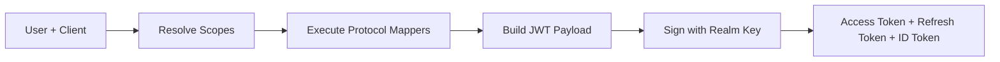

# Tokens

A successful authentication produces JSON Web Tokens. Each type has one job in the OAuth2 and OIDC protocol.

## Token types

| Token | Purpose | Default lifetime |
|---|---|---|
| Access token | Authorize API requests against a resource server | 300s |
| Refresh token | Get new access tokens without asking the user again | 86400s |
| ID token | Carry the user's identity to the client, per OIDC | 300s |
| Temporary token | Authorize the completion of required actions, nothing else | 300s |

## JWT structure

Every token is a signed JWT: header, payload, signature.

### Standard claims

| Claim | Description |
|---|---|
| `sub` | Subject, the user's id |
| `aud` | Audience, a list of client ids |
| `azp` | Authorized party, the client that requested the token |
| `iss` | Issuer, the realm URL |
| `typ` | Token type |
| `exp` | Expiration timestamp |
| `iat` | Issued-at timestamp |
| `jti` | Unique token identifier |
| `scope` | Space-separated list of granted scopes |
| `sid` | OIDC session id, the user session this token was issued against |

`sid` is absent for flows that establish no SSO session, `client_credentials` among them. Treat a missing `sid` as "not session-bound", not as an invalid token.

### Identity and mapper claims

`preferred_username` and `email` are written directly when the matching scope is granted. Everything else comes from protocol mappers configured on [client scopes](/en/discover/core-concepts/client-scopes), and is flattened into the payload:

| Claim | Source |
|---|---|
| `preferred_username` | `profile` scope |
| `given_name`, `family_name` | `profile` scope |
| `email`, `email_verified` | `email` scope |
| `realm_access.roles` | `roles` scope, through `oidc-usermodel-realm-role-mapper` |

Because mappers are configurable, the exact claim set depends on the scopes assigned to the client.

## Token lifetimes

Lifetimes come from two places:

1. Realm defaults, which apply to every client in the realm.
2. Client overrides, which win when they are set.

| Token | Realm default | Client override |
|---|---|---|
| Access token | `access_token_lifetime_secs` (300s) | `access_token_lifetime` |
| Refresh token | `refresh_token_lifetime_secs` (86400s) | `refresh_token_lifetime` |
| ID token | `id_token_lifetime_secs` (300s) | `id_token_lifetime` |
| Temporary token | `temporary_token_lifetime_secs` (300s) | `temporary_token_lifetime` |

The rule: if the client sets an override, use it, otherwise fall back to the realm.

## Token generation chain


```mermaid
graph LR
    A[User + Client] --> B[Resolve Scopes]
    B --> C[Execute Protocol Mappers]
    C --> D[Build JWT Payload]
    D --> E[Sign with Realm Key]
    E --> F[Access Token + Refresh Token + ID Token]
```

1. The user authenticates to a client
2. Default scopes (plus any requested optional scopes) are resolved
3. Protocol mappers from each scope produce claims
4. Claims are assembled into the JWT payload with standard claims
5. The token is signed using the realm's signing key and algorithm
6. Access, refresh, and (optionally) ID tokens are returned

## Token introspection

A resource server validates a token by calling the introspection endpoint:

```bash
curl -X POST http://localhost:3333/realms/{realm}/protocol/openid-connect/token/introspect \
  -H "Content-Type: application/x-www-form-urlencoded" \
  -d "token=eyJhbG..." \
  -d "client_id=my-client" \
  -d "client_secret=my-secret"
```

The response carries `active: true` or `active: false`, plus the full claim set when the token is still live.
