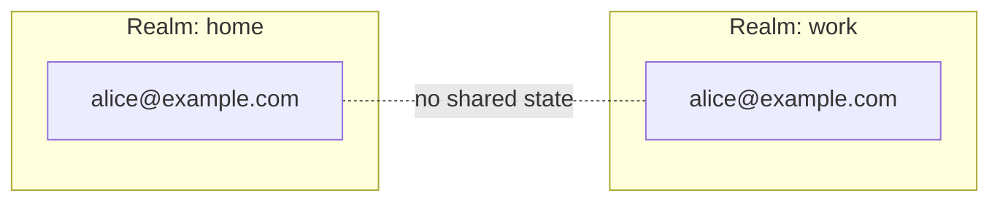
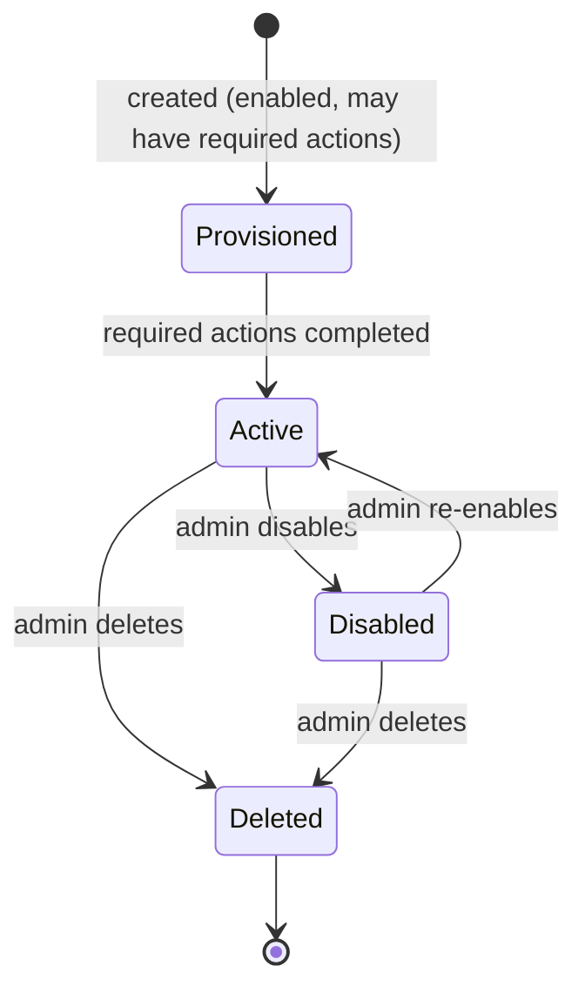
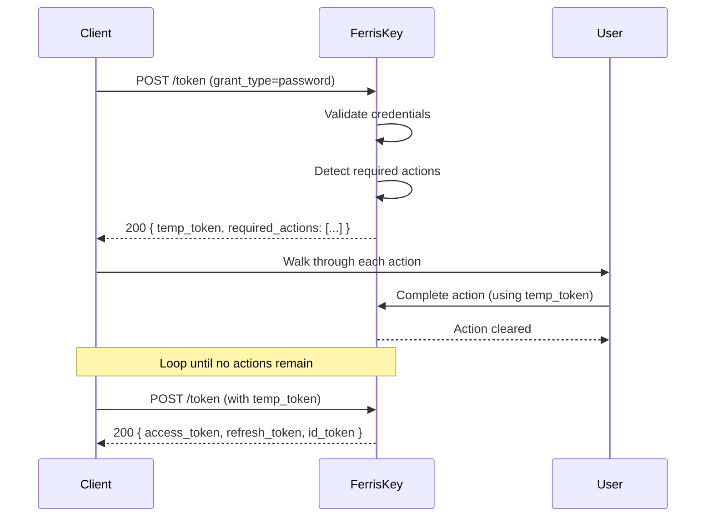

# Users

A user represents an identity within a [realm](/en/discover/core-concepts/realms). Users authenticate through [clients](/en/discover/core-concepts/clients), prove who they are with [credentials](/en/discover/core-concepts/credentials), receive [tokens](/en/discover/core-concepts/tokens), and are authorized through [role](/en/discover/core-concepts/roles) assignments.

Everything that happens at runtime — login, token issuance, authorization — ultimately resolves to a user.

## Anatomy of a User

A user is a small record. The core fields describe who they are; everything else (credentials, roles, sessions) lives in related objects.

| Property | Description |
|---|---|
| `id` | Stable internal identifier (UUID). Used everywhere tokens reference the subject. |
| `username` | Unique identifier within the realm. The login handle. |
| `email` | Email address. Optional unless the realm requires it. |
| `firstname` | Given name. |
| `lastname` | Family name. |
| `email_verified` | Whether the email has been confirmed. |
| `enabled` | Whether the account is active. A disabled user cannot authenticate. |
| `client_id` | Set only on service account users; links them to their owning client. |
| `realm_id` | The realm this user belongs to. |

A representative JSON payload returned by the admin API:

```json
{
  "id": "9a3b1c7e-2c4f-4d5a-9e7b-3c5e8a2d1f0b",
  "username": "alice",
  "email": "alice@example.com",
  "firstname": "Alice",
  "lastname": "Martin",
  "email_verified": true,
  "enabled": true,
  "realm_id": "home"
}
```

:::callout{variant="info" title="Identifiers"}
Use `id` to reference a user from other resources (role assignments, audit logs, tokens). `username` is a human-facing handle and may change; `id` is immutable.
:::

## Realm Scoping

Users are fully scoped to their realm. The same email address can exist in multiple realms as completely independent accounts. There is no cross-realm user resolution — authentication always happens within a single realm context.



If you need a single identity that spans multiple realms, federate it through the [Abyss](/en/modules/abyss/overview) module — each realm keeps its own user record, linked to the same external provider.

## User Lifecycle

From creation to deletion, a user moves through a small number of states.



- **Provisioned** — The account exists but may have pending [required actions](#required-actions) (verify email, set a permanent password, configure MFA). Authentication produces only a temporary token until the user clears them.
- **Active** — Authentication produces full tokens. Roles and group memberships apply.
- **Disabled** — `enabled = false`. The account is preserved but cannot authenticate. Tokens already issued continue to be valid until they expire; revoke sessions if you need immediate cutoff.
- **Deleted** — The user record is removed. Sessions and refresh tokens linked to it are invalidated.

## Required Actions

Required actions are tasks a user must complete before full authentication is granted. When a user has pending required actions, the authentication chain returns a **temporary token** instead of full access tokens.

| Action | When it is added | What the user must do |
|---|---|---|
| `VerifyEmail` | Email changes, or realm policy requires verification | Click the link sent by the [Trident](/en/modules/trident/overview) module |
| `UpdatePassword` | Admin marks the credential as temporary, or password expires | Set a new password |
| `ConfigureOtp` | Realm requires MFA and the user has no TOTP credential yet | Enroll a TOTP authenticator |

### How they flow



:::callout{variant="info" title="Temporary tokens"}
A temporary token is a short-lived JWT that authorizes **only** the required-action completion endpoints. It cannot be used to access protected resources, call userinfo, or refresh into a full session.
:::

:::callout{variant="warning" title="Order matters"}
Required actions are evaluated in a fixed order. `VerifyEmail` typically runs first, then `UpdatePassword`, then `ConfigureOtp`. The client should always read the `required_actions` array rather than hard-coding the order.
:::

## Service Account Users

When a [client](/en/discover/core-concepts/clients) has `service_account_enabled`, FerrisKey automatically creates a linked service account user. This user is just a regular user record, with a few distinctions:

- `username` is derived from the client (`service-account-<client_id>`).
- `client_id` points back to the owning client.
- It has no password — it authenticates exclusively through the `client_credentials` grant.
- It can be assigned roles and permissions like any other user.

It exists so that machine-to-machine calls have a real subject for authorization decisions and audit logs.

### Example

A nightly batch job is represented by a client `batch-runner` with `service_account_enabled = true`. The linked service account user `service-account-batch-runner` is granted the role `billing:read`.

```bash
curl -X POST https://sso.example.com/realms/home/protocol/openid-connect/token \
  -d "grant_type=client_credentials" \
  -d "client_id=batch-runner" \
  -d "client_secret=••••••••"
```

The resulting access token has `sub` set to the service account user's `id`, and carries the `billing:read` role. The billing API can authorize the call exactly as it would for a human user.

See [Authentication → Client Credentials](/en/discover/core-concepts/authentication#client-credentials) for the full grant.

## Sessions

A user can have multiple concurrent sessions — one per browser, device, or service that holds a valid refresh token.

| Concept | Lifetime | What it represents |
|---|---|---|
| **Auth session** | Seconds to minutes | An in-progress login (state, nonce, code, MFA challenge). Discarded once tokens are issued. |
| **User session** | Hours to days | An authenticated session. Backed by a refresh token. |
| **Access token** | Minutes | Short-lived bearer token derived from a user session. |

Revoking a refresh token ends the user session immediately; access tokens issued from it cannot be refreshed and will simply expire. For full details see [Tokens](/en/discover/core-concepts/tokens) and [Authentication → Auth Sessions](/en/discover/core-concepts/authentication#auth-sessions).

## Security Considerations

- **Disable, don't delete** — Disabling preserves audit history and role assignments. Delete only when you are sure the identity will never return.
- **Force a password rotation** — Mark the password credential as temporary; the next login will trigger the `UpdatePassword` required action.
- **Force MFA enrollment** — Configure the realm to require MFA. Existing users without TOTP will receive `ConfigureOtp` on next login.
- **Revoke active sessions** — Disabling a user does not invalidate already-issued access tokens. Revoke the user's refresh tokens to cut access immediately.
- **Audit identifiers** — Reference users by `id` in logs and external systems. Usernames and emails can change; `id` cannot.

## Related Concepts

- [Realms](/en/discover/core-concepts/realms) — the boundary a user lives in.
- [Clients](/en/discover/core-concepts/clients) — what users authenticate through.
- [Credentials](/en/discover/core-concepts/credentials) — how users prove identity.
- [Roles](/en/discover/core-concepts/roles) — how users get authorized.
- [Tokens](/en/discover/core-concepts/tokens) — what users receive after login.
- [Authentication](/en/discover/core-concepts/authentication) — the full chain that ties it together.
