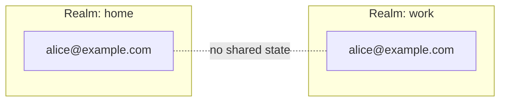
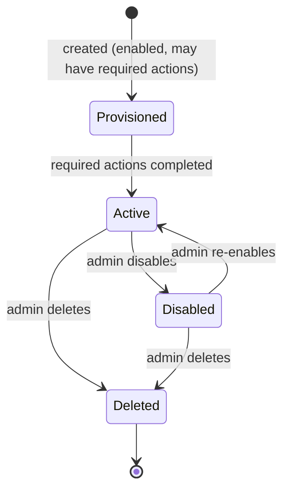
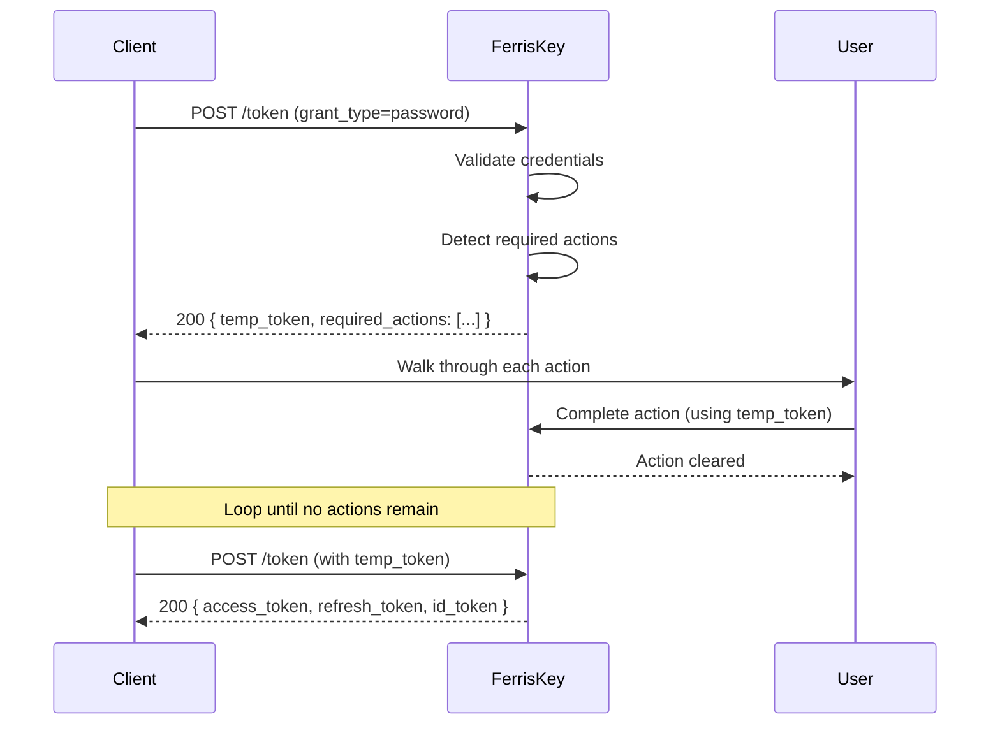

# Users

A user represents an identity within a [realm](/en/discover/core-concepts/realms). Users authenticate through [clients](/en/discover/core-concepts/clients), prove who they are with [credentials](/en/discover/core-concepts/credentials), receive [tokens](/en/discover/core-concepts/tokens), and are authorized through [role](/en/discover/core-concepts/roles) assignments.

Login, token issuance, authorization: at runtime it all resolves back to a user.

## Anatomy of a user

The user record itself is small. It describes who someone is; credentials, roles, and sessions live in related objects.

| Property | Description |
|---|---|
| `id` | Stable internal identifier (UUID). Used everywhere tokens reference the subject. |
| `username` | Unique identifier within the realm. The login handle. |
| `email` | Email address. Optional unless the realm requires it. |
| `firstname` | Given name. |
| `lastname` | Family name. |
| `email_verified` | Whether the email has been confirmed. |
| `enabled` | Whether the account is active. A disabled user cannot authenticate. |
| `client_id` | Set only on service account users; links them to their owning client. |
| `realm_id` | The realm this user belongs to. |

A representative JSON payload returned by the admin API:

```json
{
  "id": "9a3b1c7e-2c4f-4d5a-9e7b-3c5e8a2d1f0b",
  "username": "alice",
  "email": "alice@example.com",
  "firstname": "Alice",
  "lastname": "Martin",
  "email_verified": true,
  "enabled": true,
  "realm_id": "home"
}
```

:::callout{variant="info" title="Identifiers"}
Use `id` to reference a user from other resources (role assignments, audit logs, tokens). `username` is a human-facing handle and may change; `id` is immutable.
:::

## Realm scoping

Users belong to exactly one realm. The same email address can exist in several realms as entirely separate accounts. There is no cross-realm lookup: authentication always happens inside one realm.


```mermaid
graph LR
    subgraph R1["Realm: home"]
      U1["alice@example.com"]
    end
    subgraph R2["Realm: work"]
      U2["alice@example.com"]
    end
    U1 -. no shared state .- U2
```

For one identity across several realms, federate it through the [Abyss](/en/modules/abyss/overview) module. Each realm still keeps its own user record, linked to the same external provider.

## User lifecycle

A user moves through a small number of states between creation and deletion.


```mermaid
stateDiagram-v2
    [*] --> Provisioned: created (enabled, may have required actions)
    Provisioned --> Active: required actions completed
    Active --> Disabled: admin disables
    Disabled --> Active: admin re-enables
    Active --> Deleted: admin deletes
    Disabled --> Deleted: admin deletes
    Deleted --> [*]
```

**Provisioned.** The account exists but may still have pending [required actions](#required-actions): verify an email, set a permanent password, enroll in MFA. Until those are cleared, authentication only produces a temporary token.

**Active.** Authentication produces full tokens, and role assignments apply.

**Disabled.** `enabled = false`. The account is kept but cannot authenticate. Tokens already issued stay valid until they expire, so revoke sessions when you need an immediate cutoff.

**Deleted.** The record is removed, and the sessions and refresh tokens attached to it are invalidated.

## Required actions

A required action is something a user has to finish before full authentication is granted. While any are pending, the authentication chain hands back a temporary token instead of a full token set.

| Action | When it is added | What the user must do |
|---|---|---|
| `verify_email` | The email changed, or realm policy requires verification | Click the link sent by the [Trident](/en/modules/trident/overview) module |
| `update_password` | An admin marked the credential temporary, or the password expired | Set a new password |
| `configure_otp` | The realm requires MFA and the user has no TOTP credential yet | Enroll a TOTP authenticator |
| `configure_passkey` | The realm requires a passkey and the user has none registered | Register a WebAuthn passkey |

### How they flow


```mermaid
sequenceDiagram
    participant C as Client
    participant FK as FerrisKey
    participant U as User

    C->>FK: POST /token (grant_type=password)
    FK->>FK: Validate credentials
    FK->>FK: Detect required actions
    FK-->>C: 200 { temp_token, required_actions: [...] }
    C->>U: Walk through each action
    U->>FK: Complete action (using temp_token)
    FK-->>U: Action cleared
    Note over C,FK: Loop until no actions remain
    C->>FK: POST /token (with temp_token)
    FK-->>C: 200 { access_token, refresh_token, id_token }
```

:::callout{variant="info" title="Temporary tokens"}
A temporary token is a short-lived JWT that authorizes the required-action endpoints and nothing else. It cannot reach a protected resource, call userinfo, or refresh into a full session.
:::

:::callout{variant="warning" title="Order matters"}
Required actions are evaluated in a fixed order, usually `verify_email`, then `update_password`, then the MFA enrollment actions. Read the `required_actions` array in the response rather than hard-coding that order in a client.
:::

## Service account users

When a [client](/en/discover/core-concepts/clients) has `service_account_enabled`, FerrisKey creates a linked service account user. It is an ordinary user record with a few distinguishing traits:

- `username` is derived from the client (`service-account-<client_id>`).
- `client_id` points back to the owning client.
- It has no password, and authenticates only through the `client_credentials` grant.
- It can be assigned roles and permissions like any other user.

It exists so machine to machine calls have a real subject for authorization decisions and audit logs.

### Example

A nightly batch job is represented by a client `batch-runner` with `service_account_enabled = true`. The linked service account user `service-account-batch-runner` is granted the role `billing:read`.

```bash
curl -X POST https://sso.example.com/realms/home/protocol/openid-connect/token \
  -d "grant_type=client_credentials" \
  -d "client_id=batch-runner" \
  -d "client_secret=••••••••"
```

The resulting access token has `sub` set to the service account user's `id`, and carries the `billing:read` role. The billing API can authorize the call exactly as it would for a human user.

See [Authentication, client credentials](/en/discover/core-concepts/authentication#client-credentials) for the full grant.

## Sessions

A user can hold several sessions at once, one per browser, device, or service holding a valid refresh token.

| Concept | Lifetime | What it represents |
|---|---|---|
| **Auth session** | Seconds to minutes | An in-progress login (state, nonce, code, MFA challenge). Discarded once tokens are issued. |
| **User session** | Hours to days | An authenticated session. Backed by a refresh token. |
| **Access token** | Minutes | Short-lived bearer token derived from a user session. |

Revoking a refresh token ends the user session immediately. Access tokens issued from it cannot be refreshed and simply expire on their own. [Tokens](/en/discover/core-concepts/tokens) and [Authentication, auth sessions](/en/discover/core-concepts/authentication#auth-sessions) have the details.

## Security considerations

**Disable rather than delete.** Disabling keeps the audit history and the role assignments. Delete only when you are certain the identity will never come back.

**Force a password rotation** by marking the password credential temporary. The next login triggers the `update_password` required action.

**Force MFA enrollment** by setting `require_mfa` on the realm. Existing users without a TOTP credential get `configure_otp` on their next login.

**Revoke active sessions.** Disabling a user leaves already-issued access tokens working. Revoke the refresh tokens to cut access straight away.

**Reference users by `id`** in logs and external systems. Usernames and emails change; the id does not.

## Related concepts

- [Realms](/en/discover/core-concepts/realms): the boundary a user lives in.
- [Clients](/en/discover/core-concepts/clients): what users authenticate through.
- [Credentials](/en/discover/core-concepts/credentials): how users prove identity.
- [Roles](/en/discover/core-concepts/roles): how users get authorized.
- [Tokens](/en/discover/core-concepts/tokens): what users receive after login.
- [Authentication](/en/discover/core-concepts/authentication): the chain that ties it together.
