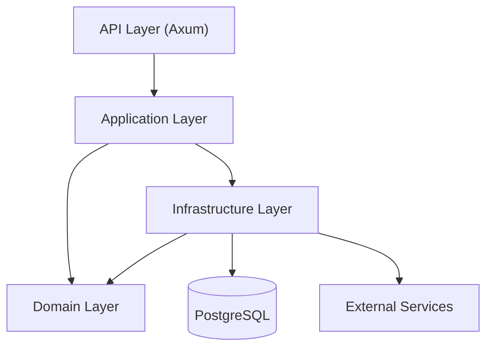

# Architecture

FerrisKey follows a **hexagonal architecture** (ports & adapters) that cleanly separates business logic from infrastructure. This design makes the system testable, modular, and resilient to change.

## Layers



### Domain Layer

The core of FerrisKey. Contains pure business logic with no dependencies on frameworks, databases, or HTTP. Each domain module defines:

- **Entities**: Immutable value objects representing domain concepts
- **Ports**: Trait definitions (interfaces) that declare what the domain needs
- **Services**: Business logic that operates on entities through ports
- **Value Objects**: DTOs for use cases and data transfer
- **Policies**: Authorization rules

### Application Layer

Orchestrates domain services. The `ApplicationService` struct wires together all domain services with their concrete implementations through dependency injection.

### Infrastructure Layer

Implements the ports defined by the domain:

- **Repositories**: Database access via SeaORM (PostgreSQL)
- **External services**: SMTP, webhook delivery, identity provider communication

### API Layer

HTTP interface built with Axum. Each feature mirrors a domain module with its own router, handlers, validators, and error types. OpenAPI documentation is generated automatically via `utoipa`.

## Domain Modules

```
core/src/domain/
├── authentication/    # OAuth2/OIDC flows
├── user/             # User lifecycle
├── client/           # OAuth2 clients
├── realm/            # Multi-tenant realms
├── credential/       # Password, OTP, WebAuthn
├── role/             # Bitwise permissions
├── session/          # User sessions
├── jwt/              # Token generation & validation
├── seawatch/         # Audit logging
├── abyss/            # Identity provider federation
└── webhook/          # Event-driven hooks
```

Standalone library crates extend the core:

```
libs/
├── ferriskey-domain/     # Shared domain types (Realm, Client, User, Token)
├── ferriskey-trident/    # MFA (TOTP, WebAuthn, magic links, recovery codes)
├── ferriskey-compass/    # Authentication flow engine
└── ferriskey-aegis/      # Client scopes & protocol mappers
```

## Dependency Flow

The dependency rule is strict: **inner layers never depend on outer layers**.

- Domain depends on nothing
- Application depends on domain (uses ports/traits)
- Infrastructure implements domain ports
- API depends on application

This means you can swap PostgreSQL for another database, replace Axum with a different HTTP framework, or test domain logic entirely in memory, without touching business rules.

## Error Propagation

Errors flow outward through automatic conversions:

1. **`CoreError`**: Domain-level errors (not found, validation, conflict)
2. **`ApiError`**: HTTP response format with status codes
3. **`From<CoreError> for ApiError`**: Automatic conversion at the boundary
