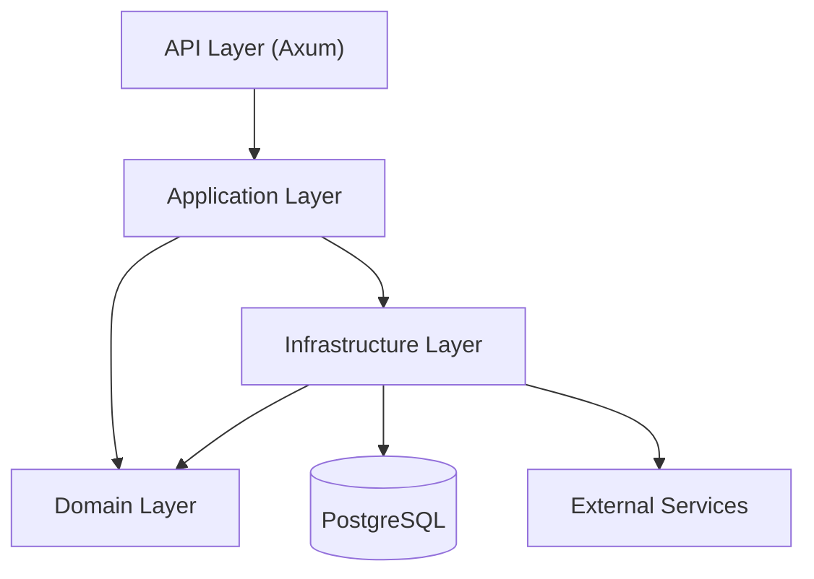

# Architecture

FerrisKey follows a hexagonal architecture, also called ports and adapters. Business logic sits in the middle and knows nothing about HTTP, SQL, or SMTP. Everything else plugs into it. That is what keeps the domain testable and lets infrastructure change without rewriting rules.

## Layers


```mermaid
graph TD
    API["API Layer (Axum)"]
    APP["Application Layer"]
    DOM["Domain Layer"]
    INF["Infrastructure Layer"]
    DB[(PostgreSQL)]
    EXT[External Services]

    API --> APP
    APP --> DOM
    INF --> DOM
    INF --> DB
    INF --> EXT
    APP --> INF
```

### Domain layer

Pure business logic, with no dependency on a framework, a database, or a transport. Each domain module is laid out the same way:

- `entities.rs` for the immutable value objects that represent domain concepts
- `ports.rs` for the traits the domain needs someone else to implement
- `services.rs` for the logic that operates on entities through those ports
- `value_objects.rs` for the use case inputs and outputs
- `policies.rs` for authorization rules, where a module has them

### Application layer

Orchestration. `ApplicationService` wires every domain service to a concrete implementation through dependency injection, and is the single place where the object graph is assembled.

### Infrastructure layer

The implementations behind the ports: repositories backed by SeaORM and PostgreSQL, plus the outbound integrations for SMTP, webhook delivery, and identity provider calls.

### API layer

The HTTP surface, built with Axum. Each feature mirrors a domain module and brings its own router, handlers, validators, and error types. OpenAPI documentation is generated from `utoipa` attributes on the handlers and served at `/swagger-ui`, `/redoc`, `/rapidoc`, and `/scalar`.

## Domain modules

```
core/src/domain/
├── authentication/       # OAuth2 / OIDC flows
├── user/                 # User lifecycle and required actions
├── account/              # Self-service account operations
├── account_security/     # Password, MFA and passkey self-service
├── client/               # OAuth2 clients
├── realm/                # Multi-tenant realms and settings
├── credential/           # Passwords, OTP, WebAuthn
├── password_policy/      # Password strength rules
├── role/                 # Bitwise permissions
├── session/              # User and auth sessions
├── jwt/                  # Token issuance and validation
├── crypto/               # Key material and signing
├── saml/                 # SAML 2.0 identity provider
├── trident/              # MFA
├── seawatch/             # Audit logging
├── compass/              # Authentication flow recording
├── abyss/                # Identity provider federation
├── aegis/                # Client scopes and protocol mappers
├── organization/         # B2B tenancy
├── email_template/       # Transactional email templates
├── email_verification/   # Email verification flow
├── portal_theme/         # Login portal theming
├── portal_layouts/       # Login portal layouts
├── webhook/              # Event-driven hooks
├── health/               # Liveness and readiness
└── maintenance/          # Maintenance mode
```

## Workspace crates

The workspace is being pulled apart into focused crates. Two families live under `libs/`.

Feature crates hold domain and infrastructure logic for one module:

```
libs/
├── ferriskey-domain/           # Shared domain types
├── ferriskey-authz/            # Authorization engine and action catalogue
├── ferriskey-security/         # Hashing and crypto primitives
├── ferriskey-trident/          # MFA
├── ferriskey-abyss/            # Identity provider federation
├── ferriskey-aegis/            # Scopes and protocol mappers
├── ferriskey-compass/          # Authentication flow engine
├── ferriskey-saml/             # SAML 2.0
├── ferriskey-seawatch/         # Audit events
├── ferriskey-organization/     # Organizations
├── ferriskey-password-policy/  # Password policies
├── ferriskey-portal-theme/     # Portal theming
├── ferriskey-portal-layouts/   # Portal layouts
├── ferriskey-webhook/          # Webhook delivery
├── ferriskey-mail/             # SMTP transport
└── ferriskey-migrate/          # Migration runner
```

`ferriskey-api-*` crates carry the HTTP layer for the matching feature, so a module's routes and handlers can move out of the monolithic API crate one at a time. `ferriskey-api-core` holds the shared pieces: CLI arguments, application state, and error conversion.

## Dependency flow

The rule is strict: inner layers never depend on outer layers.

- The domain depends on nothing
- The application depends on the domain, through ports
- The infrastructure implements the domain's ports
- The API depends on the application

Which means you can swap PostgreSQL for another store, replace Axum with a different HTTP framework, or run domain tests entirely in memory, without touching a business rule.

## Error propagation

Errors travel outward through automatic conversions:

1. `CoreError` for domain failures: not found, validation, conflict.
2. `ApiError` for the HTTP response, with a status code attached.
3. `From<CoreError> for ApiError` at the boundary, so handlers can use `?` and get the right status for free.
