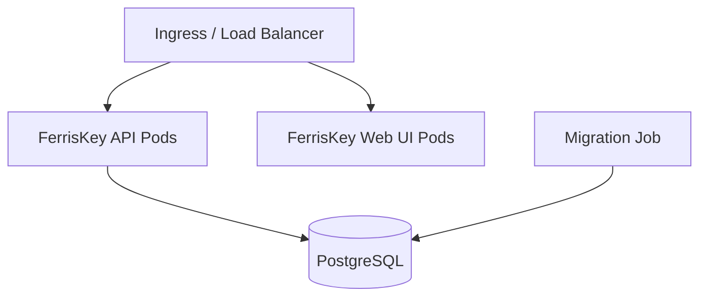

# FerrisKey on Kubernetes

FerrisKey is designed to run natively on Kubernetes. Choose between two deployment methods depending on your operational needs.

::::card-group{cols=2}
:::card{label="Helm Chart" icon="lucide:package" href="/kubernetes/default/en/helm-chart"}
Install FerrisKey with a standard Helm chart. Full control over values, familiar workflow.
:::
:::card{label="Operator" icon="lucide:bot" href="/kubernetes/default/en/operator"}
Declarative management with the FerrisKey Operator and the `FerrisKeyCluster` CRD.
:::
::::

## Architecture on Kubernetes

A typical FerrisKey deployment consists of:

- **API pods** — The FerrisKey backend handling authentication, token issuance, and administration
- **Web UI pods** — The React-based admin console
- **Migration job** — Runs database migrations on deploy
- **PostgreSQL** — The backing database (managed or self-hosted)

## Next Steps

::::card-group{cols=2}
:::card{label="Helm Chart" icon="lucide:package" href="/kubernetes/default/en/helm-chart"}
Step-by-step Helm installation guide.
:::
:::card{label="Production Guide" icon="lucide:shield" href="/kubernetes/default/en/production-guide"}
Hardening checklist for production deployments.
:::
::::
