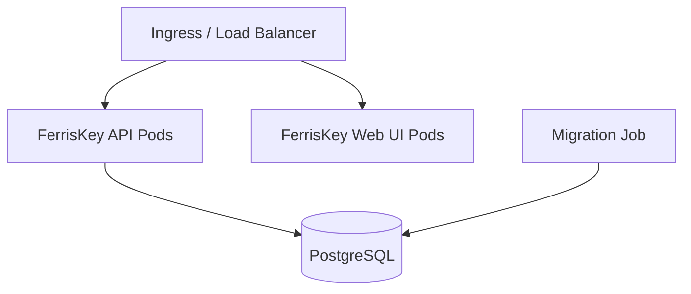

# FerrisKey on Kubernetes

FerrisKey runs natively on Kubernetes. There are two ways in, and which one fits depends on how you already operate clusters.

::::card-group{cols=2}
:::card{label="Helm Chart" icon="lucide:package" href="/en/kubernetes/helm-chart"}
A standard Helm chart with the full Kubernetes surface exposed in its values. The familiar workflow.
:::
:::card{label="Operator" icon="lucide:bot" href="/en/kubernetes/operator"}
Declarative management through the `FerrisKeyCluster` custom resource, itself installed with a Helm chart.
:::
::::

## Architecture on Kubernetes

```mermaid
graph TD
    ING[Ingress / Load Balancer]
    API[FerrisKey API Pods]
    WEB[FerrisKey Web UI Pods]
    MIG[Migration Job]
    PG[(PostgreSQL)]

    ING --> API
    ING --> WEB
    API --> PG
    MIG --> PG
```

A deployment is four pieces:

- API pods, handling authentication, token issuance, and administration
- Console pods, serving the React admin interface
- A migration job that applies pending schema changes on deploy
- PostgreSQL, managed or self-hosted

The chart bundles a PostgreSQL StatefulSet so a first install works with nothing else in place. It is not meant for production.

## Next steps

::::card-group{cols=2}
:::card{label="Helm Chart" icon="lucide:package" href="/en/kubernetes/helm-chart"}
Step-by-step Helm installation guide.
:::
:::card{label="Production Guide" icon="lucide:shield" href="/en/kubernetes/production-guide"}
Hardening checklist for production deployments.
:::
::::
