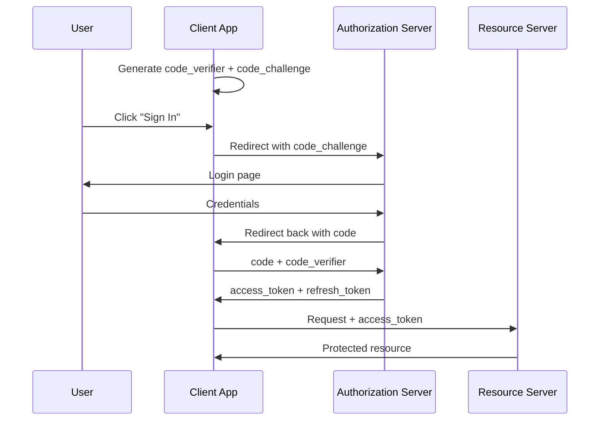

# OAuth2 Flows

OAuth2 defines several grant types, also called flows. Each one is a different choreography for the same goal: getting an access token into the hands of the right client.

The flow you pick depends on who the client is, and how well it can keep secrets.

| Flow | Use when |
| --- | --- |
| Authorization Code + PKCE | A user is in front of a browser or mobile app |
| Client Credentials | A backend service authenticates as itself, no user involved |
| Device Authorization | The device has no good way to type a password (TV, CLI) |
| Refresh Token | Renew an access token without bothering the user |

Older flows (Implicit, Resource Owner Password Credentials) still exist but are discouraged. Modern OAuth2 (`OAuth 2.1`) drops them.

## Authorization Code with PKCE

The most common flow. Used by every web app, single-page app, and mobile app that logs users in.

### The story

A user visits a web app and clicks "Sign in." The app sends them to FerrisKey, the user logs in, FerrisKey sends them back with a short code, and the app exchanges that code for a token.

The detail that matters: the code travels through the user's browser, where it is exposed. PKCE (Proof Key for Code Exchange) makes that exposure harmless.

### How PKCE works

Before the redirect, the client generates a random secret called the `code_verifier` and sends its hash (the `code_challenge`) in the authorization request. When the client later trades the code for a token, it must also send the original `code_verifier`. The server checks that `hash(code_verifier) == code_challenge`.

An attacker who intercepts the code cannot use it: they would also need the `code_verifier`, which never left the client.

### The full exchange



### Use this flow when

- You have a browser-based or mobile app and a real user.
- You want the most flexible, future-proof option.

## Client Credentials

Used for machine-to-machine calls: one backend service calling another backend service. No user is involved.

### The story

A nightly batch job needs to call your billing API. The batch job is the client. It has a `client_id` and `client_secret`, and it exchanges those for an access token directly.

```bash
curl -X POST https://auth.example.com/realms/my-app/protocol/openid-connect/token \
  -d "grant_type=client_credentials" \
  -d "client_id=batch-job" \
  -d "client_secret=••••••••"
```

### Use this flow when

- The caller is a server you control.
- The caller can safely store a secret (a private key, a static credential).
- There is no end-user in the loop.

The resulting access token represents the client itself, not a user. Permissions are tied to the client, not to a person.

## Device Authorization Flow

Used by clients that cannot easily display a login form or accept typed passwords. Smart TVs, terminal CLIs, IoT devices.

### The story

You log in to a CLI on your laptop. The CLI cannot open a browser inline, so it shows you a short code and a URL. You open the URL on your phone, type the code, log in. The CLI polls in the background. Once you finish, the CLI gets its token.

```
$ ferriskey login
Open https://auth.example.com/device in your browser
and enter code: WXYZ-1234

(waiting...)
✓ Logged in as alice@example.com
```

### Use this flow when

- The device has limited input (no keyboard) or no browser.
- You want a CLI to authenticate as a user without prompting for a password.

## Refresh Token grant

After an Authorization Code flow, the client receives both an `access_token` (short-lived, minutes) and a `refresh_token` (longer-lived). When the access token expires, the client uses the refresh token to obtain a new one silently, without redirecting the user.

```bash
curl -X POST .../token \
  -d "grant_type=refresh_token" \
  -d "refresh_token=••••••••" \
  -d "client_id=my-frontend"
```

See [Tokens](/en/learn/oauth2/tokens) for how the two token types differ.

## Flows that are out of fashion

- **Implicit Flow**: the access token was returned directly in the URL fragment. Replaced by Authorization Code + PKCE.
- **Resource Owner Password Credentials (ROPC)**: the client collects the user's password and forwards it. Defeats the point of OAuth2. Useful for migration scripts only.

## In FerrisKey

Each flow maps to a setting on your FerrisKey client:

::::card-group{cols=2}
:::card{label="Getting Started" icon="lucide:rocket" href="/en/discover/getting-started"}
Create a client and try the authorization code flow end-to-end.
:::
:::card{label="OAuth2 Tokens" icon="lucide:key" href="/en/learn/oauth2/tokens"}
What you actually get back from a successful flow.
:::
::::
