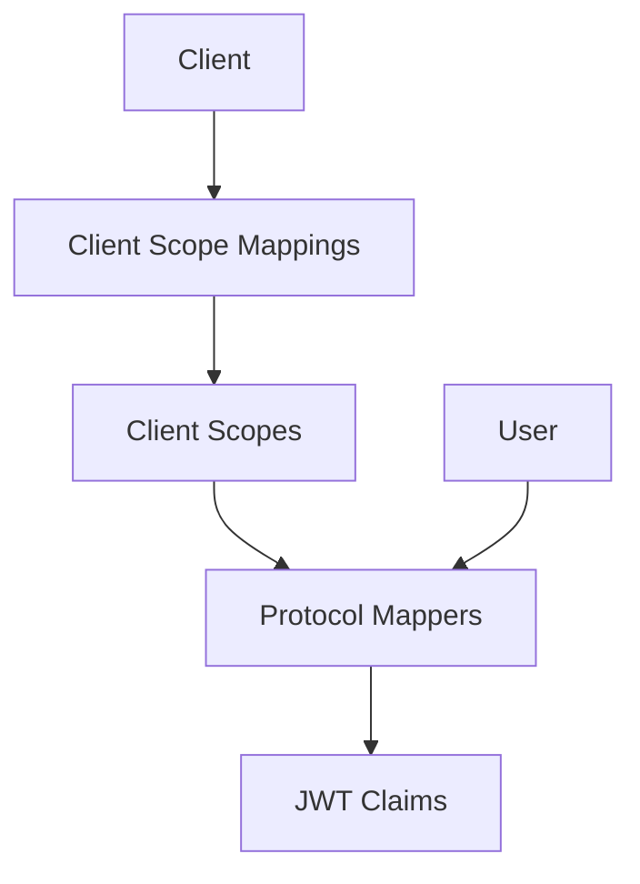

# Aegis — Scopes & Protocol Mappers

Aegis is the system that controls what information appears in your tokens. It manages **client scopes** (named collections of claims) and **protocol mappers** (rules that extract data and inject it into JWTs). Together, they form the contract between your application and FerrisKey: "Grant me this scope, and I guarantee these claims in the token."

## Why Scopes Matter

Without scopes, every token would contain the same set of claims for every client. Aegis gives you fine-grained control:

- **Minimize data exposure** — A public mobile app gets `sub` and `email`. An internal admin tool gets `realm_roles` and `permissions`. Different clients, different claims.
- **Standard compliance** — OIDC defines standard scopes (`openid`, `profile`, `email`). Aegis implements them out of the box.
- **Custom claims** — Add your own business-specific claims (department, plan tier, feature flags) through custom protocol mappers.

## Architecture

The data flow:

1. A **client** has **client scope mappings** — links to specific scopes with a type (Default/Optional)
2. Each **scope** contains one or more **protocol mappers**
3. During token generation, mappers extract data from the **user** and produce **JWT claims**
4. Claims are assembled into the final token

## Scope Types

| Type | Behavior | When to Use |
|---|---|---|
| **Default** | Automatically included in every token for assigned clients | Core claims your app always needs (email, roles) |
| **Optional** | Only included when requested via the `scope` parameter | Sensitive data the client requests on demand |
| **None** | Available in the system but not assigned to any client | Shared scope definitions waiting to be assigned |

## Standard OIDC Scopes

FerrisKey ships with the standard OpenID Connect scopes pre-configured:

| Scope | Claims | Type |
|---|---|---|
| `openid` | `sub` | Default |
| `profile` | `preferred_username`, `given_name`, `family_name` | Default |
| `email` | `email`, `email_verified` | Default |
| `address` | `address` | Optional |
| `phone` | `phone_number`, `phone_number_verified` | Optional |
| `offline_access` | Enables refresh token issuance | Optional |
| `introspect` | Allows token introspection | Optional |

## Real-World Patterns

### API Gateway with Role-Based Access
Create a custom scope `api_access` with a `user_realm_role_mapper` that includes `realm_roles` in the token. Your API gateway reads the roles claim and enforces route-level authorization without calling back to FerrisKey.

### Multi-Tenant SaaS
Create a custom scope with a `hardcoded_claim_mapper` that injects the realm name as a `tenant` claim. Your backend uses this to route requests to the correct tenant database.

### Third-Party Integrations
Assign only `openid` and `email` as default scopes for third-party clients. They get the minimum data needed. Your first-party clients get `profile`, `roles`, and custom scopes as defaults.
