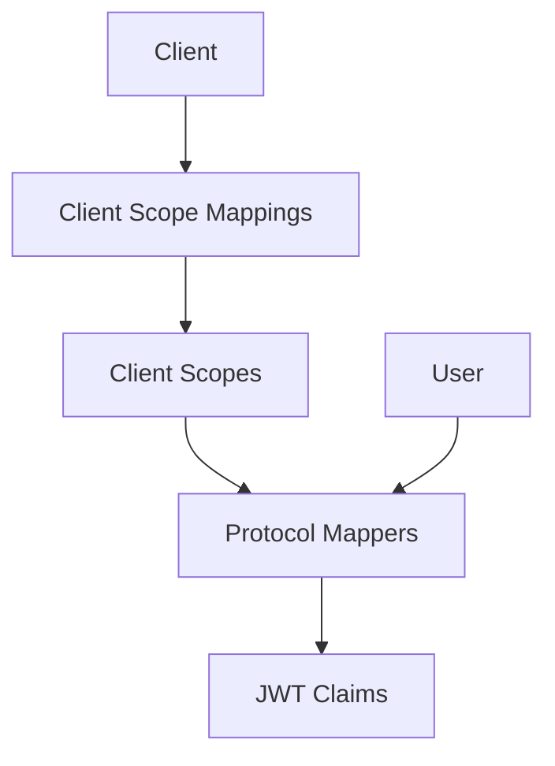

# Aegis: Scopes & Protocol Mappers

Aegis decides what information ends up in a token. It owns client scopes, which are named collections of claims, and protocol mappers, which are the rules that pull data out and write it into the JWT. Together they are the contract between an application and FerrisKey: grant me this scope, and these claims will be in the token.

## Why scopes matter

Without them, every client would get identical claims. With them, a public mobile app gets `sub` and `email` while an internal admin tool gets roles, and neither sees more than it needs.

The standard OIDC scopes (`openid`, `profile`, `email`) are seeded into every realm. Anything specific to your business, a department, a plan tier, a feature flag, goes in through a custom protocol mapper.

## Architecture

```mermaid
graph TD
    CS[Client Scopes] --> PM[Protocol Mappers]
    PM --> JWT[JWT Claims]
    C[Client] --> CSM[Client Scope Mappings]
    CSM --> CS
    U[User] --> PM
```

How data moves:

1. A client carries client scope mappings, each linking it to a scope as default or optional.
2. Each scope holds one or more protocol mappers.
3. At token generation, the mappers read from the user and produce claims.
4. The claims are assembled into the token.

## Scope types

| Type | Behavior | When to use |
|---|---|---|
| Default | Included in every token for the clients it is assigned to | Claims the app always needs, like email or roles |
| Optional | Included only when the request asks for it in `scope` | Data the client should have to ask for |
| **None** | Available in the system but not assigned to any client | Shared scope definitions waiting to be assigned |

## Standard OIDC scopes

FerrisKey ships with the standard OpenID Connect scopes pre-configured:

| Scope | Claims | Type |
|---|---|---|
| `openid` | `sub` | Default |
| `profile` | `preferred_username`, `given_name`, `family_name` | Default |
| `email` | `email`, `email_verified` | Default |
| `address` | `address` | Optional |
| `phone` | `phone_number`, `phone_number_verified` | Optional |
| `offline_access` | Enables refresh token issuance | Optional |
| `introspect` | Allows token introspection | Optional |

## Real-World Patterns

### API gateway with role-based access
Create a custom scope `api_access` with a `user_realm_role_mapper` that includes `realm_roles` in the token. Your API gateway reads the roles claim and enforces route-level authorization without calling back to FerrisKey.

### Multi-Tenant SaaS
Create a custom scope with a `hardcoded_claim_mapper` that injects the realm name as a `tenant` claim. Your backend uses this to route requests to the correct tenant database.

### Third-Party Integrations
Assign only `openid` and `email` as default scopes for third-party clients. They get the minimum data needed. Your first-party clients get `profile`, `roles`, and custom scopes as defaults.
