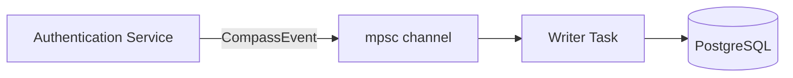

# Architecture

Compass is designed to observe authentication without slowing it down. The core challenge: recording step-by-step flow data to a database during a latency-sensitive login request. Compass solves this with an asynchronous, channel-based architecture that decouples recording from the hot path.

## The FlowRecorder

The `FlowRecorder` is the single entry point for all Compass operations. It's injected into the authentication service and exposes three methods:

```rust title="FlowRecorder API"
// Create a new flow (awaits persistence for FK safety)
async fn start_flow(realm_id, client_id, grant_type, ip, user_agent) -> FlowId

// Record a step (fire-and-forget, non-blocking)
fn record_step(flow_id, step_name, status, duration_ms, error_code, error_message)

// Mark the flow as completed (fire-and-forget, non-blocking)
fn complete_flow(flow_id, status, duration_ms, user_id)
```

### Channel Architecture



The FlowRecorder communicates with a background writer task through a Tokio `mpsc` (multi-producer, single-consumer) channel. Three event types flow through the channel:

| Event | Behavior | Blocking? |
|---|---|---|
| `FlowStarted` | Creates the flow record. Includes a `oneshot` acknowledgment channel. | **Yes**: waits for DB write |
| `StepRecorded` | Persists a step record. | No, fire and forget |
| `FlowCompleted` | Updates the flow with final status, duration, and user ID. | No, fire and forget |

### Why `FlowStarted` Blocks

The `start_flow()` method is the only one that awaits a response. This is intentional: the flow ID is used as a foreign key on `auth_sessions.compass_flow_id`. If the flow hasn't been persisted yet when the auth session is created, the FK constraint would fail. The `oneshot` acknowledgment ensures the flow exists in the database before returning:

```rust title="FlowStarted with acknowledgment"
pub async fn start_flow(&self, ...) -> FlowId {
    let flow = CompassFlow::new(...);
    let id = flow.id.clone();

    let (ack_tx, ack_rx) = oneshot::channel();
    self.send(CompassEvent::FlowStarted { flow, ack: ack_tx });

    // Wait for the writer to persist the flow
    let _ = ack_rx.await;

    id
}
```

### Backpressure and Graceful Degradation

The channel has a bounded capacity. When the channel is full (the writer can't keep up):

1. `try_send()` fails immediately
2. The event is dropped
3. A warning is logged: `"Compass: channel full, dropping event"`
4. **Authentication continues normally**: Compass never blocks or fails a login

This is a deliberate design choice: observability data is valuable but not critical. A dropped step record is acceptable; a blocked login request is not.

### Disabled Mode

When `compass_enabled` is `false`, the FlowRecorder is constructed with `FlowRecorder::disabled()`:

```rust title="Disabled FlowRecorder"
pub fn disabled() -> Self {
    Self {
        enabled: Arc::new(AtomicBool::new(false)),
        sender: None, // No channel allocated
    }
}
```

All methods check the `enabled` flag first and return immediately. No channel, no events, no database writes. The `Arc<AtomicBool>` allows toggling at runtime without restarting the server.

## Persistence Layer

Compass uses two repository traits for database access:

### `CompassFlowRepository`

| Method | Description |
|---|---|
| `create_flow(flow)` | Insert a new flow record |
| `update_flow_status(flow_id, status, completed_at, duration_ms, user_id)` | Mark a flow as completed |
| `get_flows(realm_id, filter)` | Query flows with filtering and pagination |
| `get_flow_by_id(flow_id)` | Fetch a single flow by ID |
| `count_flows(realm_id, filter)` | Count matching flows |
| `purge_old_flows(older_than)` | Delete flows older than a given date |
| `get_stats(realm_id)` | Aggregate statistics for a realm |

### `CompassFlowStepRepository`

| Method | Description |
|---|---|
| `create_step(step)` | Insert a step record |
| `get_steps_for_flow(flow_id)` | Fetch all steps for a flow |

Both repositories are implemented via SeaORM against PostgreSQL, following FerrisKey's hexagonal architecture (traits in `ports.rs`, implementations in `infrastructure/`).

## Data Lifecycle

### Retention

Compass flows accumulate over time. For a high-traffic realm, this can mean thousands of flows per day. The `purge_old_flows(older_than)` method removes flows (and their steps, via CASCADE) older than a given timestamp.

:::callout{variant="warning" title="Plan your retention"}
Compass does not auto-purge. Set up a scheduled task to call `purge_old_flows()` periodically, for example, deleting flows older than 30 days. This keeps the database manageable and queries fast.
:::

### Storage Estimate

A rough estimate per flow:

| Component | Size |
|---|---|
| Flow record | ~200 bytes |
| Step record (each) | ~150 bytes |
| Average steps per flow | 3-5 |

For a realm with **10,000 logins/day**, that's approximately **7-9 MB/day** or **250 MB/month**. Plan your PostgreSQL storage accordingly.
