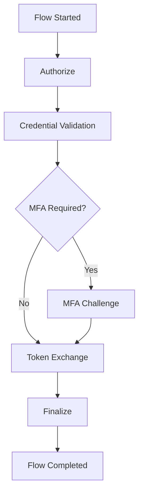

# Compass — Authentication Flow Engine

Compass is FerrisKey's authentication flow engine. It records every authentication attempt as a structured **flow** — a sequence of named steps with individual outcomes, timings, and error details. Compass gives you deep observability into how users authenticate, where failures occur, and how long each step takes.

## Why Compass?

Authentication looks simple from the outside: the user logs in and gets a token. But inside, a single login request can involve redirect validation, credential hashing, MFA challenges, external IdP callbacks, session creation, and token signing. When something fails, you need to know *which step* broke and *why*.

Without Compass, a failed login is just a `401`. With Compass, you see:

> Flow `01914b3c-...` for client `my-frontend` via `authorization_code`:
> ✓ authorize (12ms) → ✓ credential_validation (85ms) → ✗ mfa_challenge (0ms, error: `invalid_otp`) → Flow failed at 97ms

## How It Works

When Compass is enabled, every authentication request creates a `CompassFlow`. As the request progresses through credential validation, MFA challenges, token exchange, and finalization, each step is recorded as a `CompassFlowStep` with its own status and duration.

## Flow Lifecycle

Each flow progresses through a clear lifecycle:

::::step-group
:::step{title="Flow Created"}
When an authentication request arrives, Compass creates a `CompassFlow` with the realm, client, grant type, IP address, and user agent. The flow status is `pending`.
:::

:::step{title="Steps Recorded"}
As the authentication progresses, each step (authorize, credential validation, MFA, etc.) is recorded with its outcome, duration, and any error details. Steps are persisted asynchronously.
:::

:::step{title="User Identified"}
After successful credential validation, the `user_id` is attached to the flow. This links the flow to a specific user for later querying.
:::

:::step{title="Flow Completed"}
When authentication finishes (success or failure), the flow is marked as completed with a final status, completion timestamp, and total duration in milliseconds.
:::
::::

## Flow Structure

A `CompassFlow` captures the full picture of an authentication attempt:

| Field | Type | Description |
|---|---|---|
| `id` | `UUIDv7` | Unique flow identifier (time-ordered for efficient querying) |
| `realm_id` | `UUID` | Realm context |
| `client_id` | `String` | Client ID that initiated the authentication |
| `user_id` | `UUID?` | Authenticated user (set after credential validation succeeds) |
| `grant_type` | `String` | OAuth2 grant type (`authorization_code`, `password`, `client_credentials`, `refresh_token`) |
| `status` | `FlowStatus` | Overall outcome: `pending`, `success`, `failure`, `expired` |
| `ip_address` | `String?` | Source IP address |
| `user_agent` | `String?` | Client user agent |
| `started_at` | `DateTime` | When the flow began |
| `completed_at` | `DateTime?` | When the flow finished (null while pending) |
| `duration_ms` | `i64?` | Total flow duration in milliseconds |
| `steps` | `Vec<FlowStep>` | Ordered list of step records |

### Flow Status Values

| Status | Meaning |
|---|---|
| `pending` | Flow is in progress — steps are still being recorded |
| `success` | Authentication completed successfully, tokens were issued |
| `failure` | Authentication failed at one of the steps |
| `expired` | The auth session expired before completion (user took too long) |

## Flow Steps

Each step within a flow records:

| Field | Type | Description |
|---|---|---|
| `id` | `UUIDv7` | Unique step identifier |
| `flow_id` | `UUID` | Parent flow reference |
| `step_name` | `FlowStepName` | One of the 7 step types |
| `status` | `StepStatus` | `success`, `failure`, or `skipped` |
| `duration_ms` | `i64?` | Step execution time in milliseconds |
| `error_code` | `String?` | Machine-readable error code (on failure) |
| `error_message` | `String?` | Human-readable error description (on failure) |
| `started_at` | `DateTime` | When the step began executing |

### Step Types

| Step | When It Executes | Typical Duration |
|---|---|---|
| `authorize` | OAuth2 authorization request validation — checks redirect URI, scope, response type, CSRF state | &lt;5ms |
| `credential_validation` | Username lookup + password hash verification (Argon2) | 50–200ms |
| `mfa_challenge` | TOTP code validation or WebAuthn assertion verification | 5–50ms |
| `token_exchange` | Authorization code → token exchange (code lookup + token generation) | 10–30ms |
| `idp_redirect` | Building and recording the redirect to an external identity provider | &lt;5ms |
| `idp_callback` | Processing the callback from an external IdP (token exchange + user lookup) | 100–500ms |
| `finalize` | Session creation, SeaWatch event emission, and cleanup | 5–15ms |

### Step Status Values

| Status | Meaning |
|---|---|
| `success` | Step completed successfully |
| `failure` | Step failed — check `error_code` and `error_message` |
| `skipped` | Step was not applicable (e.g., `mfa_challenge` skipped when no MFA is configured) |

## Configuration

| Setting | Default | Description |
|---|---|---|
| `compass_enabled` | `true` | Enable/disable flow recording per realm |

When disabled, authentication works exactly the same — the flow recording is simply skipped. No flows are created, no steps are recorded, and no database writes occur. Toggle this off for realms where you don't need flow-level observability.

:::callout{variant="info" title="Zero performance impact when disabled"}
When `compass_enabled` is `false`, the FlowRecorder short-circuits immediately. No channels are used, no database writes happen, no memory is allocated for flow objects.
:::
