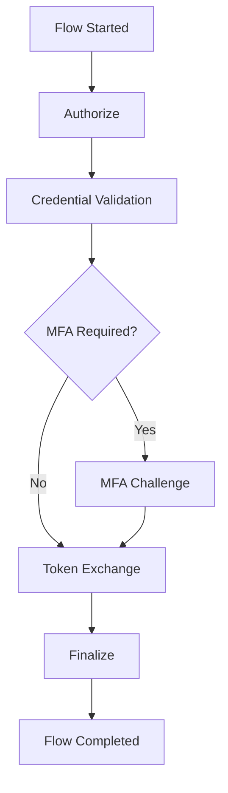

# Compass: Authentication Flow Engine

Compass records each authentication attempt as a flow: a sequence of named steps, each with its own outcome, duration, and error details. It is how you find out where a login actually went wrong.

## Why

From outside, authentication is one request and one token. Inside, it is redirect validation, credential hashing, an MFA challenge, maybe an external IdP round trip, session creation, and token signing. When it fails, `401` tells you nothing about which of those broke.

With Compass you get this instead:

> Flow `01914b3c-...` for client `my-frontend` via `authorization_code`:
> ✓ authorize (12ms) → ✓ credential_validation (85ms) → ✗ mfa_challenge (0ms, error: `invalid_otp`) → Flow failed at 97ms

Each row is one authentication execution: its grant type, its outcome, how many steps it went through and how long it took. A `pending` row with zero steps is an authorization request that was started and never completed — normal in small numbers, and a signal when it is not.

## How it works

With Compass on, every authentication request opens a `CompassFlow`. As the request moves through credential validation, the MFA challenge, token exchange, and finalization, each step is written as a `CompassFlowStep` with its own status and duration.

```mermaid
graph TD
    A[Flow Started] --> B[Authorize]
    B --> C[Credential Validation]
    C --> D{MFA Required?}
    D -->|Yes| E[MFA Challenge]
    D -->|No| F[Token Exchange]
    E --> F
    F --> G[Finalize]
    G --> H[Flow Completed]
```

## Flow lifecycle

::::step-group
:::step{title="Flow Created"}
When an authentication request arrives, Compass creates a `CompassFlow` with the realm, client, grant type, IP address, and user agent. The flow status is `pending`.
:::

:::step{title="Steps Recorded"}
As the authentication progresses, each step (authorize, credential validation, MFA, etc.) is recorded with its outcome, duration, and any error details. Steps are persisted asynchronously.
:::

:::step{title="User Identified"}
After successful credential validation, the `user_id` is attached to the flow. This links the flow to a specific user for later querying.
:::

:::step{title="Flow Completed"}
When authentication finishes (success or failure), the flow is marked as completed with a final status, completion timestamp, and total duration in milliseconds.
:::
::::

## Flow structure

A `CompassFlow` holds the whole attempt:

| Field | Type | Description |
|---|---|---|
| `id` | `UUIDv7` | Unique flow identifier (time-ordered for efficient querying) |
| `realm_id` | `UUID` | Realm context |
| `client_id` | `String` | Client ID that initiated the authentication |
| `user_id` | `UUID?` | Authenticated user (set after credential validation succeeds) |
| `grant_type` | `String` | OAuth2 grant type (`authorization_code`, `password`, `client_credentials`, `refresh_token`) |
| `status` | `FlowStatus` | Overall outcome: `pending`, `success`, `failure`, `expired` |
| `ip_address` | `String?` | Source IP address |
| `user_agent` | `String?` | Client user agent |
| `started_at` | `DateTime` | When the flow began |
| `completed_at` | `DateTime?` | When the flow finished (null while pending) |
| `duration_ms` | `i64?` | Total flow duration in milliseconds |
| `steps` | `Vec<FlowStep>` | Ordered list of step records |

### Flow status values

| Status | Meaning |
|---|---|
| `pending` | Flow is in progress, steps are still being recorded |
| `success` | Authentication completed successfully, tokens were issued |
| `failure` | Authentication failed at one of the steps |
| `expired` | The auth session expired before completion (user took too long) |

## Flow steps

Each step records:

| Field | Type | Description |
|---|---|---|
| `id` | `UUIDv7` | Unique step identifier |
| `flow_id` | `UUID` | Parent flow reference |
| `step_name` | `FlowStepName` | One of the nine step types |
| `status` | `StepStatus` | `success`, `failure`, or `skipped` |
| `duration_ms` | `i64?` | Step execution time in milliseconds |
| `error_code` | `String?` | Machine-readable error code (on failure) |
| `error_message` | `String?` | Human-readable error description (on failure) |
| `started_at` | `DateTime` | When the step began executing |

### Step types

| Step | When It Executes | Typical Duration |
|---|---|---|
| `authorize` | OAuth2 authorization request validation, checks redirect URI, scope, response type, CSRF state | &lt;5ms |
| `credential_validation` | Username lookup + password hash verification (Argon2) | 50-200ms |
| `mfa_challenge` | TOTP code validation or WebAuthn assertion verification | 5-50ms |
| `token_exchange` | Authorization code → token exchange (code lookup + token generation) | 10-30ms |
| `idp_redirect` | Building and recording the redirect to an external identity provider | &lt;5ms |
| `idp_callback` | Processing the callback from an external IdP (token exchange + user lookup) | 100-500ms |
| `finalize` | Session creation, SeaWatch event emission, and cleanup | 5-15ms |
| `saml_authn_request` | Parsing an incoming SAML `AuthnRequest` and resolving the service provider | &lt;5ms |
| `saml_assertion` | Building and signing the SAML assertion sent back to the service provider | 5-20ms |

### Step status values

| Status | Meaning |
|---|---|
| `success` | Step completed successfully |
| `failure` | Step failed, check `error_code` and `error_message` |
| `skipped` | Step was not applicable (e.g., `mfa_challenge` skipped when no MFA is configured) |

## Configuration

| Setting | Default | Description |
|---|---|---|
| `compass_enabled` | `true` | Enable/disable flow recording per realm |

Turn it off and authentication behaves identically, minus the recording: no flows, no steps, no database writes. Worth doing on realms where you do not need step-level observability.

:::callout{variant="info" title="Off costs nothing"}
With `compass_enabled` set to `false`, the FlowRecorder short-circuits on entry. No channel is used, no row is written, no flow object is allocated.
:::
