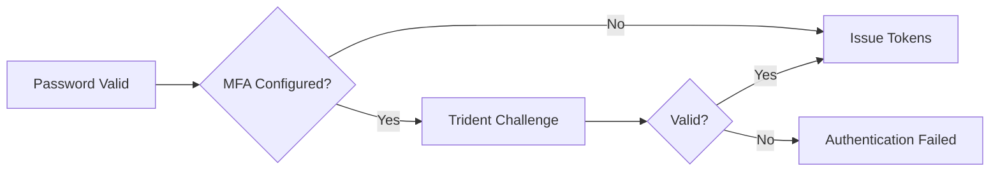

# Trident — Multi-Factor Authentication

Trident is FerrisKey's MFA module. It adds second-factor verification to the authentication chain, turning a password-only login into a multi-step proof of identity. Trident supports four authentication methods that can be combined depending on your security requirements.

## Why MFA Matters

Passwords alone are not enough. Credential stuffing, phishing, and brute-force attacks make single-factor authentication a liability. MFA ensures that even if a password is compromised, an attacker cannot access the account without the second factor.

FerrisKey enforces MFA through the **required actions** system. When a user has `ConfigureOtp` as a required action, they must set up a TOTP credential before gaining full access. This makes MFA enrollment mandatory rather than optional.

## Available Methods

::::card-group{cols=2}
:::card{label="TOTP" icon="lucide:clock" href="/modules/default/en/trident/totp"}
Time-based one-time passwords. Works with Google Authenticator, Authy, 1Password, and any RFC 6238 compatible app.
:::
:::card{label="WebAuthn" icon="lucide:fingerprint" href="/modules/default/en/trident/webauthn"}
FIDO2 passkeys — hardware security keys (YubiKey), Touch ID, Face ID, Windows Hello, and synced passkeys.
:::
:::card{label="Magic Links" icon="lucide:mail" href="/modules/default/en/trident/magic-links"}
Passwordless email login. A unique link is sent to the user's inbox — click to authenticate.
:::
:::card{label="Recovery Codes" icon="lucide:file-key" href="/modules/default/en/trident/recovery-codes"}
One-time backup codes for account recovery when the primary MFA device is lost.
:::
::::

## How Trident Fits in the Authentication Chain

Trident operates between credential validation and token issuance:

When a user authenticates with valid credentials:

1. FerrisKey checks if the user has any MFA credentials (TOTP, WebAuthn)
2. If yes, the response status is `requires_otp_challenge` with a **temporary token**
3. The client uses the temporary token to submit the second factor
4. On success, full access/refresh/ID tokens are issued

:::callout{variant="info" title="Temporary tokens"}
The temporary token returned during the MFA challenge is short-lived (default: 300 seconds) and can only be used to complete the MFA step or other required actions. It cannot access protected resources.
:::

## Real-World Deployment Patterns

### SaaS Application with Mandatory MFA
Set `ConfigureOtp` as a required action for all new users in the realm. Users must configure TOTP on first login before they can access your application.

### Enterprise with Passwordless
Configure WebAuthn as the primary authenticator and disable password-based login on the client. Users sign in with Touch ID or a YubiKey — no passwords to phish.

### Consumer App with Optional MFA
Let users opt in to TOTP or WebAuthn through a self-service settings page. Don't set required actions — MFA is available but not enforced.
