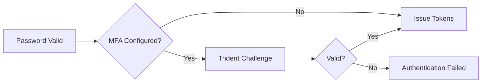

# Trident: Multi-Factor Authentication

Trident is the MFA module. It sits in the authentication chain between a valid password and a token, and turns a single-factor login into a multi-step one. Four methods are available, and they combine.

## Why bother

Credential stuffing and phishing make a password on its own a liability. A second factor means a stolen password is not enough on its own to get in.

Enrollment is enforced through required actions. Set `require_mfa` on the realm and users without a TOTP credential pick up `configure_otp` on their next login, which they have to clear before they get a real token.

## Available methods

::::card-group{cols=2}
:::card{label="TOTP" icon="lucide:clock" href="/en/modules/trident/totp"}
Time-based one-time passwords. Works with Google Authenticator, Authy, 1Password, and any RFC 6238 compatible app.
:::
:::card{label="WebAuthn" icon="lucide:fingerprint" href="/en/modules/trident/webauthn"}
FIDO2 passkeys, hardware security keys (YubiKey), Touch ID, Face ID, Windows Hello, and synced passkeys.
:::
:::card{label="Magic Links" icon="lucide:mail" href="/en/modules/trident/magic-links"}
Passwordless email login. A unique link is sent to the user's inbox, click to authenticate.
:::
:::card{label="Recovery Codes" icon="lucide:file-key" href="/en/modules/trident/recovery-codes"}
One-time backup codes for account recovery when the primary MFA device is lost.
:::
::::

## Where Trident sits

Between credential validation and token issuance:

```mermaid
graph LR
    A[Password Valid] --> B{MFA Configured?}
    B -->|No| C[Issue Tokens]
    B -->|Yes| D[Trident Challenge]
    D --> E{Valid?}
    E -->|Yes| C
    E -->|No| F[Authentication Failed]
```

Once the credentials check out:

1. FerrisKey looks for MFA credentials on the user, TOTP or WebAuthn.
2. If there are any, the response comes back as `requires_otp_challenge` with a temporary token.
3. The client submits the second factor using that temporary token.
4. On success, the real access, refresh, and ID tokens are issued.

:::callout{variant="info" title="Temporary tokens"}
The temporary token handed out during the challenge lives 300 seconds by default and only authorizes the MFA step and other required actions. It cannot touch a protected resource.
:::

## Three ways teams use it

**Mandatory MFA on a SaaS product.** Turn on `require_mfa` for the realm. Every user configures TOTP on first login before reaching the application.

**Passwordless in an enterprise.** Make WebAuthn the primary authenticator and turn off password login on the client. People sign in with Touch ID or a YubiKey, and there is no password left to phish.

**Optional MFA on a consumer app.** Leave `require_mfa` off and let users enroll TOTP or a passkey from their settings page. Available, not enforced.
