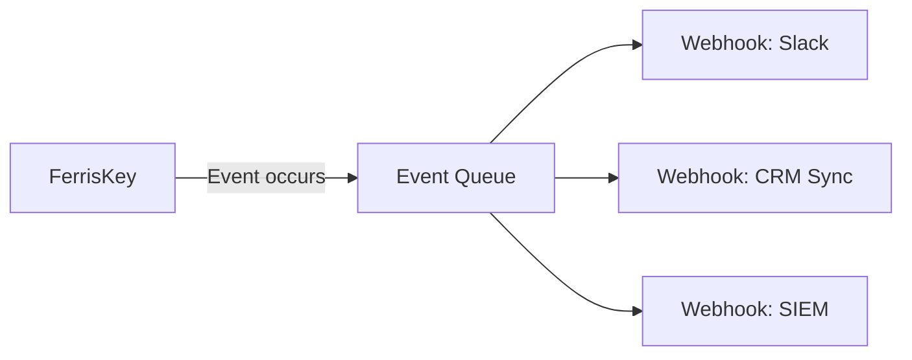

# Webhooks: Event-Driven Extensibility

Webhooks let you react to events in FerrisKey by pushing HTTP notifications to external systems. When something happens, a user is created, a role is assigned, a client secret is rotated. FerrisKey sends an HTTP POST to your registered endpoints with a structured payload.

## Why Webhooks?

FerrisKey manages identity, but your application lives outside of it. Webhooks bridge the gap:

- **Real-time sync**: Keep external systems (CRM, data warehouse, email marketing) in sync with user changes without polling
- **Automation**: Trigger downstream workflows when specific events occur (welcome emails, Slack notifications, provisioning)
- **Monitoring**: Forward events to alerting systems for security-sensitive actions
- **Decoupling**: Your application reacts to events without being tightly coupled to FerrisKey's internals

## How It Works

::::step-group
:::step{title="Register a webhook"}
Create a webhook with a target endpoint URL, optional custom headers, and a name/description. The webhook is scoped to a realm.
:::

:::step{title="Subscribe to events"}
Add subscribers to the webhook, each subscriber listens for a specific trigger event (e.g., `user.created`, `client.deleted`).
:::

:::step{title="Events fire"}
When a matching event occurs in the realm, FerrisKey builds a payload and sends an HTTP POST to the webhook endpoint.
:::
::::

## Webhook Structure

A webhook in FerrisKey consists of:

| Field | Description |
|---|---|
| `id` | Unique webhook identifier |
| `endpoint` | Target URL for HTTP POST delivery |
| `headers` | Custom HTTP headers (e.g., `Authorization`, `X-Webhook-Secret`) |
| `name` | Human-readable name |
| `description` | Optional description |
| `subscribers` | List of event subscriptions |
| `triggered_at` | Last time any subscriber fired |
| `created_at` / `updated_at` | Timestamps |

## Real-World Patterns

::::card-group{cols=2}
:::card{label="User Onboarding" icon="lucide:user-plus"}
On `user.created`, send a welcome email, provision a trial account in your billing system, and notify the sales team in Slack.
:::
:::card{label="Security Monitoring" icon="lucide:alert-triangle"}
Forward `auth.reset_password` and `client.secret_rotated` events to PagerDuty or Opsgenie for on-call alerting.
:::
:::card{label="Data Sync" icon="lucide:refresh-cw"}
On `user.updated` and `user.deleted`, sync changes to your CRM, data warehouse, or marketing platform in real time.
:::
:::card{label="Audit Forwarding" icon="lucide:database"}
Forward all events to Splunk, Elastic, or a custom SIEM for long-term storage and compliance reporting.
:::
::::
