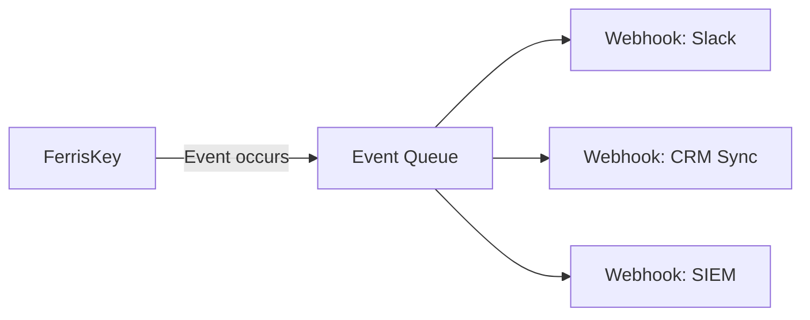

# Webhooks: Event-Driven Extensibility

Webhooks push HTTP notifications outward when something happens in FerrisKey. A user is created, a role is assigned, a client is deleted: FerrisKey POSTs a structured payload to the endpoints you registered.

## Why

FerrisKey owns identity. Your application does not live inside it. Webhooks are the seam between the two.

They keep a CRM, a warehouse, or a marketing platform current without anyone polling. They start downstream work, a welcome email, a Slack message, a provisioning job, at the moment the event happens. They push security-relevant actions into your alerting. And they do all of that without your application knowing anything about FerrisKey's internals.

## How it works

```mermaid
graph LR
    FK[FerrisKey] -->|Event occurs| Q[Event Queue]
    Q --> W1[Webhook: Slack]
    Q --> W2[Webhook: CRM Sync]
    Q --> W3[Webhook: SIEM]
```

::::step-group
:::step{title="Register a webhook"}
Create a webhook with a target endpoint URL, optional custom headers, and a name/description. The webhook is scoped to a realm.
:::

:::step{title="Subscribe to events"}
Add subscribers to the webhook. Each one listens for a single trigger event, such as `user.created` or `client.deleted`.
:::

:::step{title="Events fire"}
When a matching event occurs in the realm, FerrisKey builds a payload and sends an HTTP POST to the webhook endpoint.
:::
::::

## Webhook structure

A webhook holds:

| Field | Description |
|---|---|
| `id` | Unique webhook identifier |
| `endpoint` | Target URL for HTTP POST delivery |
| `headers` | Custom HTTP headers (e.g., `Authorization`, `X-Webhook-Secret`) |
| `name` | Human-readable name |
| `description` | Optional description |
| `subscribers` | List of event subscriptions |
| `triggered_at` | Last time any subscriber fired |
| `created_at` / `updated_at` | Timestamps |

## What people wire up

::::card-group{cols=2}
:::card{label="User onboarding" icon="lucide:user-plus"}
On `user.created`, send a welcome email, provision a trial account in your billing system, and notify the sales team in Slack.
:::
:::card{label="Security monitoring" icon="lucide:alert-triangle"}
Forward `auth.reset_password` and `client.maintenance.enabled` events to PagerDuty or Opsgenie for on-call alerting.
:::
:::card{label="Data sync" icon="lucide:refresh-cw"}
On `user.updated` and `user.deleted`, sync changes to your CRM, data warehouse, or marketing platform in real time.
:::
:::card{label="Audit forwarding" icon="lucide:database"}
Forward all events to Splunk, Elastic, or a custom SIEM for long-term storage and compliance reporting.
:::
::::
